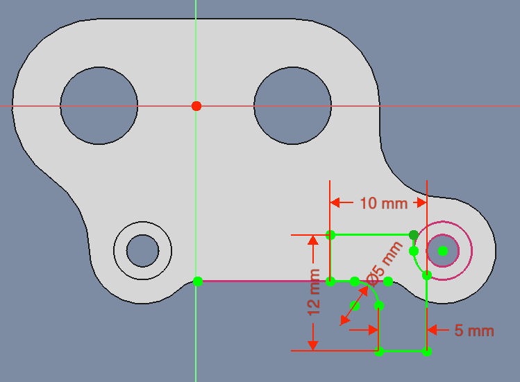
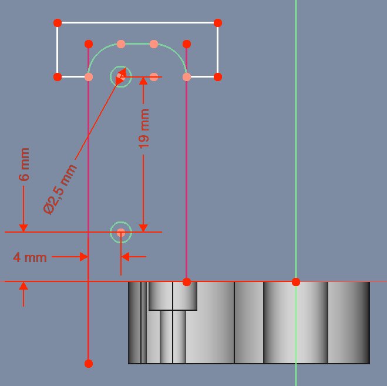
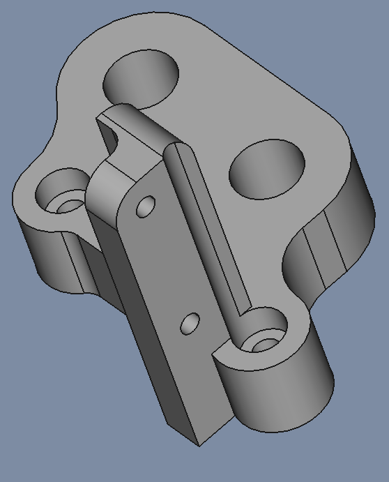
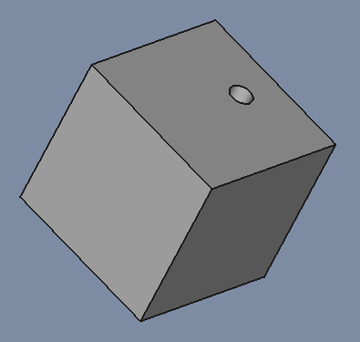
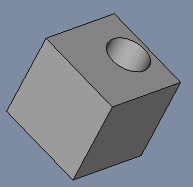

# Y_Axis

## MotorMount

| File | Link |
| --- | --- |
| FreeCad | [Y_Axis.FCStd](./Y_Axis.FCStd) |
| STL | [Y_Axis-Body_MortorMount.stl](./stl/Y_Axis-Body_MortorMount.stl) |

### Sketch002

* Sketch
  * Support: XY_Plane001
  * Map Mode: FlatFace
  * Map Reversed: false
  * Attachment Offset
    * Angle: 0,00°
    * Axis: [X: 0,00 Y: 0,00 z: 1,00]
    * Position: (x: 0,00 mm, y: 0,00 mm, z: 0,00 mm)

### Pad001

* Pad
  * Type: Length
  * Length: 10,00 mm
* Sketch Based
  * Midplane: false
  * Reversed: true
  * Alow Multi Face: true

### Sketch003

* Sketch
  * Support: XY_Plane001
  * Map Mode: FlatFace
  * Map Reversed: false
  * Attachment Offset
    * Angle: 0,00°
    * Axis: [X: 0,00 Y: 0,00 z: 1,00]
    * Position: (x: 0,00 mm, y: 0,00 mm, z: 0,00 mm)

### Pocket001

* Pocket
  * Type: Lenght
  * Length: 3,50 mm
* Sketch Based
  * Midplane: false
  * Reversed: false
  * Alow Multi Face: true

### Sketch004

* Sketch
  * Support: XY_Plane001
  * Map Mode: FlatFace
  * Map Reversed: false
  * Attachment Offset
    * Angle: 0,00°
    * Axis: [X: 0,00 Y: 0,00 z: 1,00]
    * Position: (x: 0,00 mm, y: 0,00 mm, z: 0,00 mm)

### Pad002

* Pad
  * Type: Length
  * Length: 29,00 mm
  * Length2: 10,00 mm
* Sketch Based
  * Midplane: false
  * Reversed: false
  * Alow Multi Face: true

### Sketch005

* Sketch
  * Support: XY_Plane001
  * Map Mode: FlatFace
  * Map Reversed: false
  * Attachment Offset
    * Angle: 0,00°
    * Axis: [X: 0,00 Y: 0,00 z: 1,00]
    * Position: (x: 0,00 mm, y: 0,00 mm, z: 0,00 mm)

### Pocket002

* Pocket
  * Type: ThroughAll
* Sketch Based
  * Midplane: true
  * Reversed: false
  * Alow Multi Face: true

### Fillet001

* Fillet
  * Radius: 1,00 mm
  Use All Edges: false

## Lock

### Sketch007

* Sketch
  * Support: XY_Plane002
  * Map Mode: FlatFace
  * Map Reversed: false
  * Attachment Offset
    * Angle: 0,00°
    * Axis: [X: 0,00 Y: 0,00 z: 1,00]
    * Position: (x: 0,00 mm, y: 0,00 mm, z: 0,00 mm)

### Pad003

* Pad
  * Type: Length
  * Length: 18,00 mm
* Sketch Based
  * Midplane: false
  * Reversed: true
  * Alow Multi Face: true

### Sketch006

* Sketch
  * Support: XY_Plane002
  * Map Mode: FlatFace
  * Map Reversed: false
  * Attachment Offset
    * Angle: 0,00°
    * Axis: [X: 0,00 Y: 0,00 z: 1,00]
    * Position: (x: 0,00 mm, y: 0,00 mm, z: 0,00 mm)

### Pocket003

* Pocket
  * Type: Length
  * Length: 15,00 mm
* Sketch Based
  * Midplane: true
  * Reversed: false
  * Alow Multi Face: true

### Sketch008

* Sketch
  * Support: XY_Plane002
  * Map Mode: FlatFace
  * Map Reversed: false
  * Attachment Offset
    * Angle: 0,00°
    * Axis: [X: 0,00 Y: 0,00 z: 1,00]
    * Position: (x: 0,00 mm, y: 0,00 mm, z: 5,00 mm)

### Pocket004

* Pocket
  * Type: Length
  * Length: 5,00 mm
* Sketch Based
  * Midplane: true
  * Reversed: true
  * Alow Multi Face: true

### Fillet001

* Fillet
  * Radius: 2,00 mm
  Use All Edges: false

