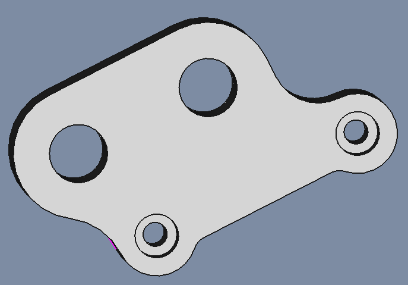
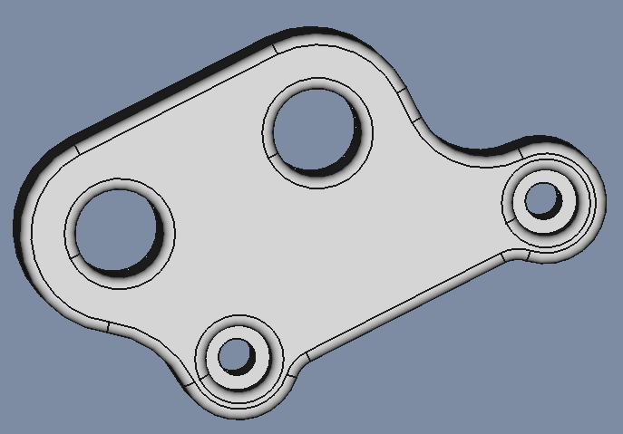

# Y_Axis-MotorMount

## Sketch

* Sketch
  * Support: XY_Plane
  * Map Mode: FlatFace
  * Map Reversed: false
  * Attachment Offset
    * Angle: 0,00°
    * Axis: [X: 0,00 Y: 0,00 z: 1,00]
    * Position: (x: 0,00 mm, y: 0,00 mm, z: 0,00 mm)

## Pad

* Pad
  * Type: Length
  * Length: 10,00 mm
* Sketch Based
  * Midplane: false
  * Reversed: false
  * Alow Multi Face: true

## Sketch001

* Sketch
  * Support: XY_Plane
  * Map Mode: FlatFace
  * Map Reversed: false
  * Attachment Offset
    * Angle: 0,00°
    * Axis: [X: 0,00 Y: 0,00 z: 1,00]
    * Position: (x: 0,00 mm, y: 0,00 mm, z: 0,00 mm)

## Pocket

* Pocket
  * Type: Lenght
  * Length: 3,50 mm
* Sketch Based
  * Midplane: false
  * Reversed: true
  * Alow Multi Face: true

## Fillet

