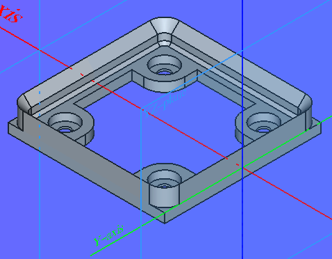
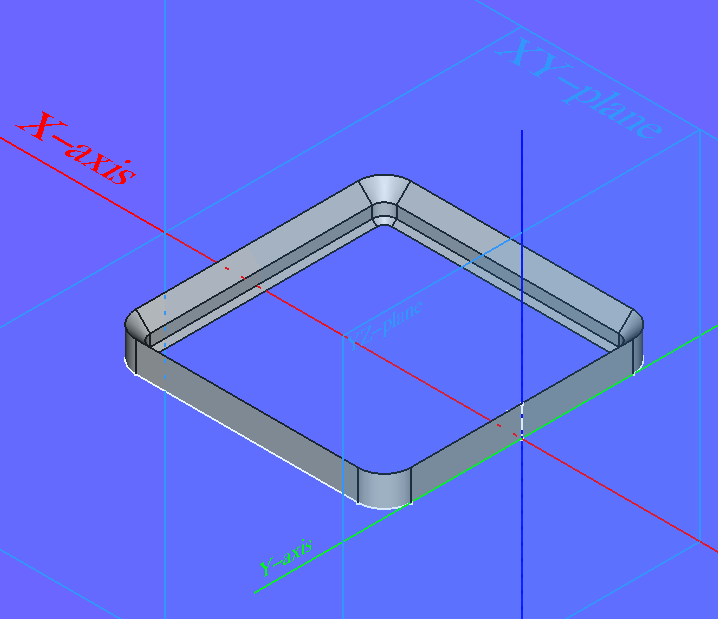
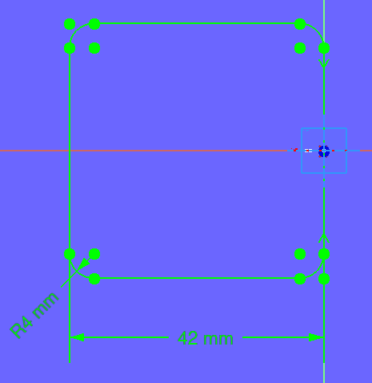
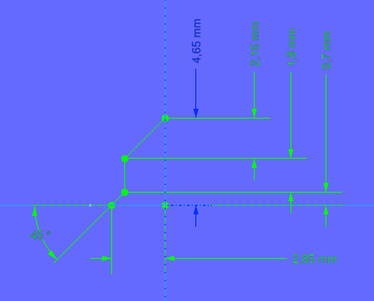
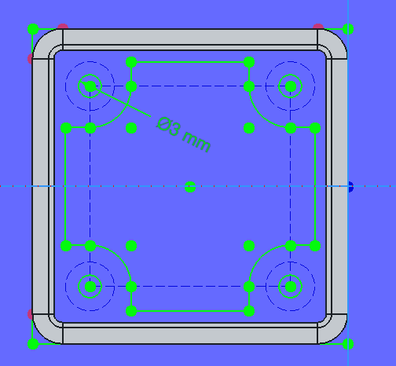
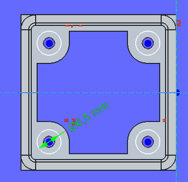

# GridfinityParametric

* Kilde:
  * [Zack Freedman](https://www.youtube.com/@ZackFreedman)
    * [Gridfinity is an invention of Zack Freedman, which he introduced in a YouTube video Apr 12, 2022.](https://www.youtube.com/watch?v=ra_9zU-mnl8)
  * [grizzie17](https://www.printables.com/@grizzie17)
    * [Gridfinity Specification](https://www.printables.com/model/417152-gridfinity-specification)
    * [Gridfinity Refined](https://www.printables.com/model/413761-gridfinity-refined)
* Opgave Filer:
  * Base:
    * [1. Base-Spreadsheet](./)
    * [2. Base-AdditivePipe](./)
    * [3. Base-SubtractivePipe](./)
  * Bins:

## Base-AdditivePipe

### AdditivePipe Spreadsheet Cell properties

|A|B|C|D|
|:---|---:|:---:|:---:|
|**Alias**|**Content**|**Display unit**||
|**Base:**||||
|GridfinityBaseWidth|42.00|mm||
|**AdditivePipe:**||||
|BaseAdditivePipeRadius|4.00|mm||
|BaseAdditivePipeWidth|2.85|mm||
|BaseAdditivePipeHead|2.15|mm||
|BaseAdditivePipeBody|1.80|mm||
|BaseAdditivePipeFoot|0.70|mm||
|BaseAdditivePipeHeigt|=BaseAdditivePipeHead + BaseAdditivePipeBody + BaseAdditivePipeFoot|mm|Calculated|
|BaseAdditiveAngle|90.00|deg||
|**MagnetFoot:**||||
|MagnetDiameter|6.00|mm||
|MagnetHoleDiameter|=MagnetDiameter + 0.50|mm|Calculated|
|MagnetOuterRingDiameter|=MagnetHoleDiameter + 2.00|mm|Calculated|
|MagnetTicknes|2.00|mm||
|MagnetHoleDepth|=MagnetTicknes + 0.50|mm|Calculated|
|MagnetCenterDistance|=GridfinityBaseWidth - (BaseAdditivePipeRadius * 2) - MagnetHoleDiameter|mm|Calculated|
|MagnetPadLength|=MagnetHoleDepth + 0.50|mm|Calculated|

### AdditivePipe

|XY-plane|XZ-plane|
|:---:|:---:|
|||

### MagnetFoot

|XY-plane FootSketch|XY-plane MagnetHoleSketch|
|:---:|:---:|
|||

## Base-SubtractivePipe

### SubtractivePipe Spreadsheet Cell properties

|BaseplateProfileView|BaseplatePlanView|SubtractivePipe|
|:---:|:---:|:---:|
||||

## Grids

### Spreadsheet Cell properties

|A|B|C|D|
|:---|:---|:---:|:---:|
||||

## Bins

|A|B|C|D|
|:---|:---|:---:|:---:|
|**Grids:**||||
|NumberGridX|1||mm|
|NumberGridY|2||mm|
|**Bins:**||||
|BinSquaresX|2|||
|BinSquaresY|2|||
|BinHeight|75||mm|
|BinDepth|=BinHeight - 1|Calculated|mm|
|BinX|=41.5 + (BinSquaresX - 1) * 42|Calculated|mm|
|BinY|=41.5 + (BinSquaresY - 1) * 42|Calculated|mm|
