# Draft ShapeString tutorial

Source: [Draft ShapeString tutorial - FreeCAD Documentation](https://wiki.freecad.org/Draft_ShapeString_tutorial)

## Introduction

This tutorial was originally written by Roland Frank ( † 2017, r-
frank), and it was rewritten and re-illustrated by vocx. I will now rewrite it to fix for FreeCAD version 0.20.2 and make some change I find help the flow

This tutorial describes a method to create 3D text and use it with
solid objects in the Part Workbench. We will discuss how to

* insert outlined text with the Draft ShapeString tool,
* extrude it to be a 3D solid with Part Extrude ,
* position it in 3D space using placement, and Draft Move (it uses a sketch as auxiliary geometry), and 
* engrave the text by applying a boolean Part Cut .

To use ShapeStrings inside the PartDesign Workbench, the process is essentially the same as with the Part Workbench, but the ShapeString is placed inside the PartDesign Body to extrude it. Go to the end of this tutorial for more information.

## Setup

* Open FreeCAD, create a new empty document with File → New,  

## Insert the ShapeString

* Switch to the **Draft Workbench**.
  * 
  * Make sure nothing is selected in the tree view.
  * Establish the working plane 
    * by clicking 
    * . 
    * SelectPlane and pressing  Top (XY)
    * 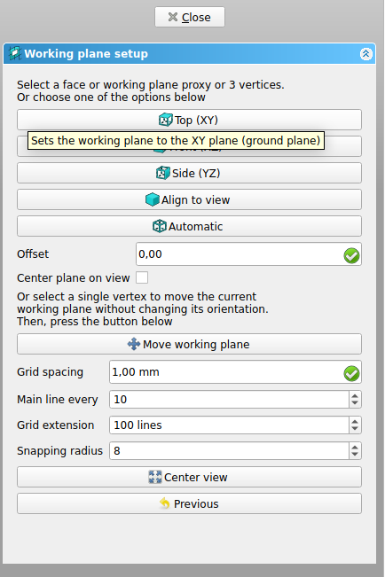
* Insert the text **"FreeCAD"**.
  * Click on **Shape from Text** icon. 
  * ShapeString
    * 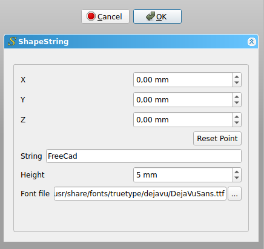
    * Change **String** to **FreeCAD**; change **Height** to **5mm**.
    * Make sure Font file points to a valid font, for example, **/usr/share/fonts/truetype/dejavu/DejaVuSans.ttf**. Press the ellipsis **[...]** to open the operating system's dialog to find a font.
    * Press [Reset point].
    * Press [OK] . This will create a ShapeString object.
  * Recompute the document by pressing [Refresh]. 
* Measure Text Length
  * To see the ShapeString from above change the view by pressing [Top (XY)] , or [2] in the keyboard. 
  * Select **Measure distance** 
    * Start from front **F** in FreeCAD to Back of **D** in FreeCAD I get a distance of 26,90 mm
* To restore the view to isometric, press [View isometric] , or [0} in the keyboard.
  * 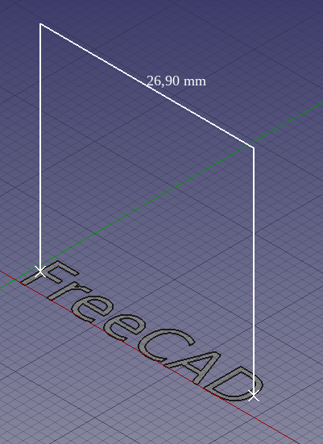

## Create the solid 3D text

* Switch back to the **Part Workbench**.
  * In the **tree view**, select **ShapeString**, then press **[Extrude]**. 
  * 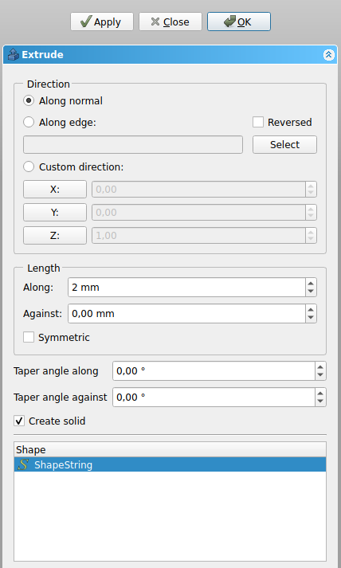
  * In the **Extrude** task panel go to 
    * **Direction**, choose **Along normal**;
    * **Length**, set **Along** to 2 mm;
    * tick the **Create solid** option.
  * Press OK . This will create an Extrude object.
  * Hide Distance by selecting in Tree view and click [Space]
  * 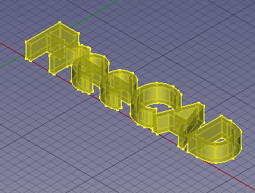

## Positioning the solid text in 3D space

* Switch to the Sketcher Workbench.
  * In the tree view, select Extrude, in the Data tab of the property editor, 
  * 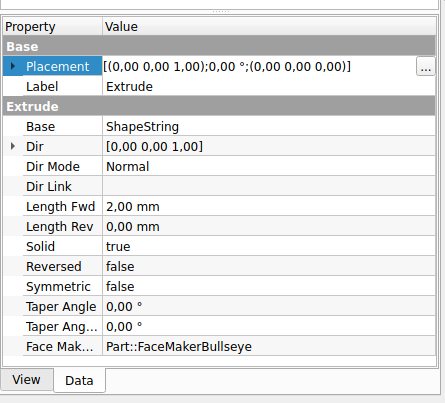
  * click on the Placement value so the ellipsis button **[...]** appears on the right and
  * **click on that button**.
    * Tick the option **Apply incremental changes**.
    * Change the Rotation to **Rotation axis with angle**;
    * 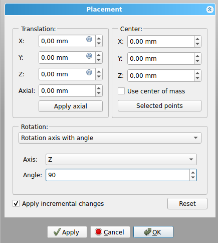
      * Axis to Z, 
      * and Angle to **90 deg**, 
      * then click on **[Apply]. This will apply a rotation around the Z-axis, and will reset the Angle field to zero.
    * Change the Rotation to 
    * 
      * Rotation axis with angle **Axis to Y**
      * and Angle to **45 deg**, 
      * then click on Apply . This will apply a rotation around the Y-axis, and will reset the Angle field to zero.
    * Click on **[OK]** to close the dialog.
    * 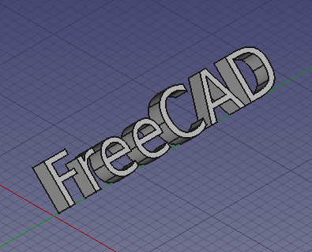

## Create the basic shape

* Switch back to the **Part Workbench**.
  * Insert a **primitive cube** by clicking on **Box**. 
    * Select Cube in the tree view.
    * Change the dimensions in the **Data tab** of the property editor.
    * Change **Width** to **31 mm**.
    * 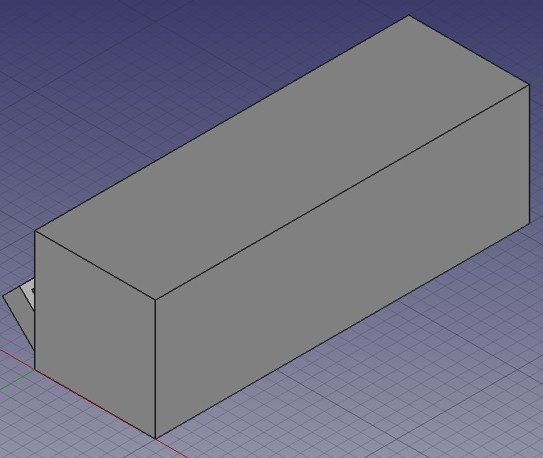
  * Create a chamfer.
    * Press **Chamfer**. 
    * 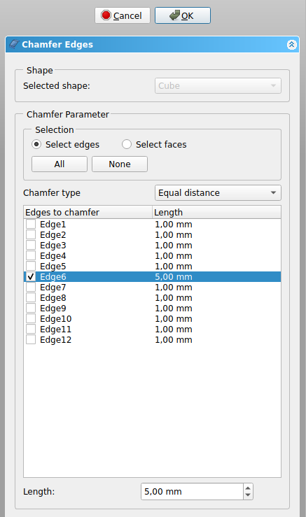
      * In the Chamfer edges task panel go to Selection, choose **Select edges**. 
      * As Chamfer type choose **Equal distance**, then set Length to **5 mm**.
      * Press **[OK}** . This will create a Chamfer object.
      * 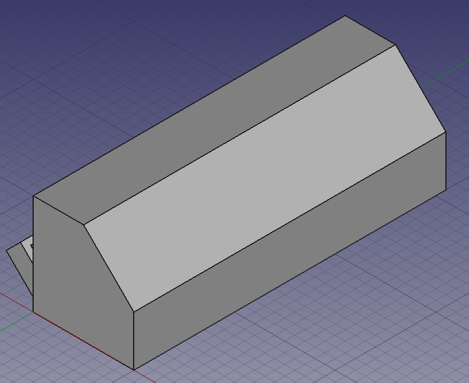

## Insert auxiliary sketch for positioning

Now we will draw a simple sketch that will be used as auxiliary geometry to position the ShapeString extrusion.

* Switch to the **Sketcher Workbench**.
  * Choose the **sloped face** created by the chamfer operation.
  * 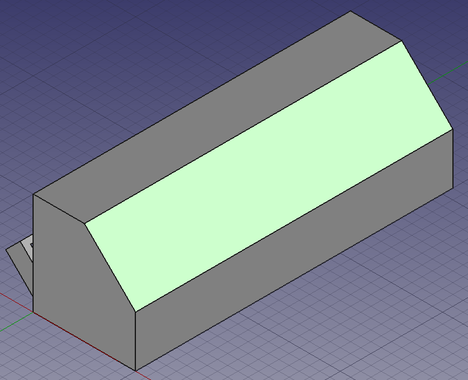
  * Click on **NewSketch** .
    * 
    * In the Sketch attachment dialog, select FlatFace,
    * and press **[OK]** .
    * The view should adjust automatically so that the camera is parallel to the selected face.
    * Press **[X Close]**
    * In the tree view, select Sketch, in the Data tab of the property editor,
    * 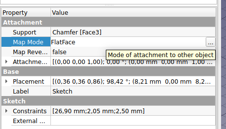
      * click on the **Map Mode** value so the ellipsis button **[...]** appears on the right and
      * **click on that button**.
      * 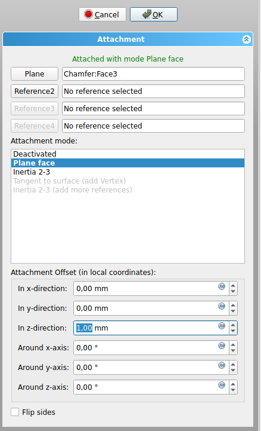
        * In the **Attachment Offset (in local coordinates**.
        * Change **z-direction** to **1 mm**
      * 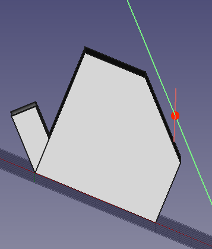
  * Draw a horizontal line in a general position on top of the face.
  * 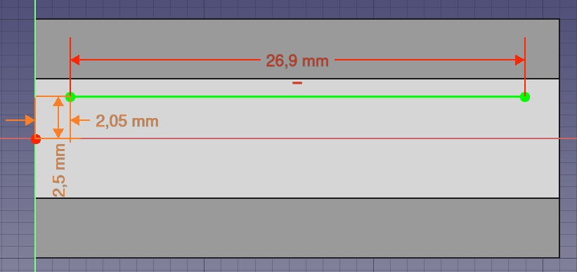
    * The length is set to length of Text string (**26,90 mm**); 
    * Horizontal distance fro center point to Line left endpoint will bee
      * **(Cube Width - Text length)/2**
      * **(31mm - 26,90 mm)/2 = 2,05 mm**
    * Constrain the left endpoint to be
      * **(Text Height)/2**
      * **5 mm/2 = 2.5 mm**
      * away from the local X axis, using Vertical Distance.
  * [Close] the sketch.
  * 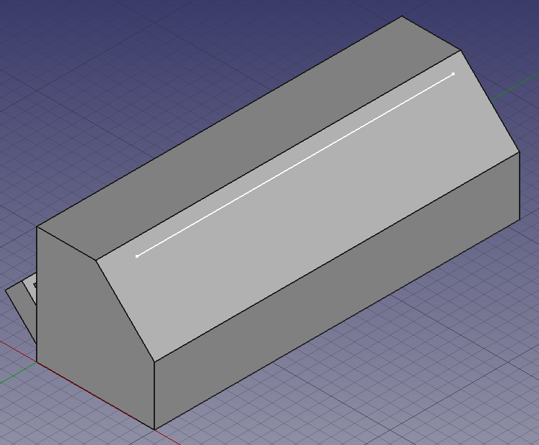

## Move Extruded text to sketch

* Switch again to the **Draft Workbench**.
  * Switch to **Wireframe** 
    * draw style with **View → Draw style → Wireframe**, 
    * or press the **V,3**. This will allow you to see the objects behind other objects.
  * Make sure the **Draft Snap "Snap to endpoint"** method is active.
  * 
    * This can be done by pressing the **ToggleSnap** and **Snap endpoint buttons** in the **Snap toolbar**.
  * In the **tree view**, select **Extrude**.
  * 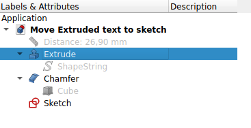
    * Click on **Move**. 
      * In the 3D view **click on the upper left corner point of the Extrude object (1)**, and then **click on the leftmost point in the line drawn with the sketcher (2)**.
      * 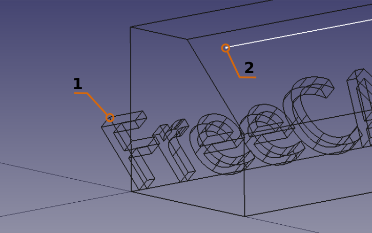
      * If Snap endpoint is active, as soon as you move the pointer close to a vertex, you should see that it attaches to it exactly.
      * The extruded text should now be inside the body of the Fillet object.

## Creating engraved text

* Switch back to the Part Workbench.
  * Switch to "As is" draw style with View → Draw style → As is, or press the As is button in the view toolbar. This will show all objects with the normal shading and color.
  * In the tree view, select Sketch, and press Space in the keyboard to make it invisible.
* In the tree view select Chamfer first, and then Extrude.
  * Then press Cut . This will create a Cut object. This is the final object.
  * In the tree view, select Cut, in the View tab change the value of Line Width to 2.0.