# Opgave 001 Part Design  

I den første opgave skal vi tegne et skab, der har følgende mål:  

* Udvendig Højde: **600mm**  
* Udvendig Bredde: **300mm**  
* Udvendig Dybde: **300mm**  
* Matriale tykkelse: **12mm**  
* Bagbeklædning matriale tykkelse: **6mm**  
* Bagbeklædningen skal forsænkes **10mm** fra bagkant  
* Hjørne skal være 45°

## Opret ny opgave

* Klik på
  * File -> New

### Gem opgaven i ./Dokumenter/FreeCAD/Opgave_001

* File -> Save As
  * Vælg Dokument mappen
    * Klik på **Create New Folder**
      * Navngiv den nye Folder **FreeCAD**
      * File name: Opgave_001
      * 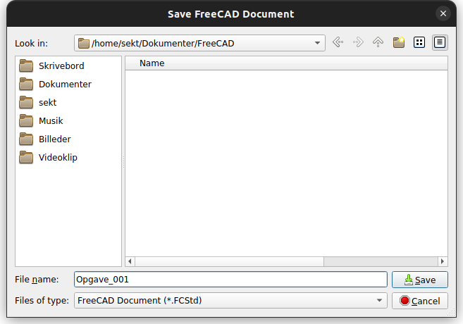
      * Klik **Save**

## [ PartDesign_Body - SkabsSide](https://wiki.freecad.org/PartDesign_Body)  

### [ Sketcher_New - Sketch](https://wiki.freecad.org/Sketcher_NewSketch)

* Attachment  
  * Support: **XZ_Plane**  
* Skabs højde: 600mm
* plade tykelse: 12mm
* vinkel i top og bund: 45°

### [ PartDesign_Pad - Pad](https://wiki.freecad.org/PartDesign_Pad)

* Pad parameter
  * Type: **Dimention**
  * Length: **300mm**
  * Direction
    * Direction/egde: **Sketch normal**
    * Show direction: **Not Checked**
    * Length along sketch normal:  **Checked**
  * Symmetric to plane: **Not Checked**
  * Reversed: **Checked**
  * Taper angle: **0,00°**
  * Update view: **Checked**

### [ Sketcher_NewSketch - Pocket_Sketch001](https://wiki.freecad.org/Sketcher_NewSketch)

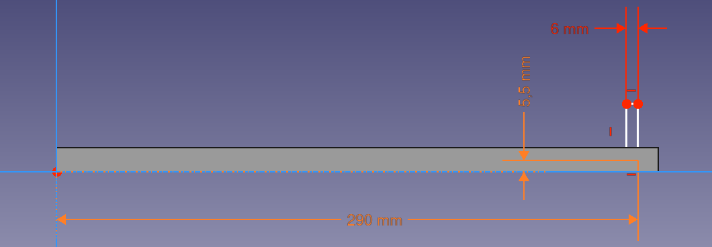

* Attachment  
  * Support: **XZ_Plane**  
* Ydre kant på pocket: 300mm - 10mm = 290mm
  * skabsdybde: **300mm**
  * bagbeklædning afstand fra bagkant: **10mm**
  * bagbeklæbnings tykkelse: **6mm**

### [ PartDesign_Pocket - Pocket](https://wiki.freecad.org/PartDesign_Pocket) 

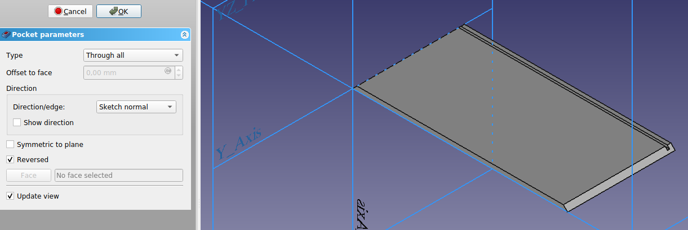

* Pocket parameter
  * Type: **Through all**
  * Offset to face:
  * Direction
    * Direction/egde: **Sketch normal**
    * Show direction: **Not Checked**
  * Symmetric to plane: **Not Checked**
  * Reversed: **Checked**
  * Update view: **Checked**

### [ PartDesign_Plane - DatumPlane](https://wiki.freecad.org/PartDesign_Plane) 

* Support: **XY_Plane**
* Attachment Offset
  * Position
    * x: **0,00mm**
    * y: **0,00mm**
    * z: **12,00mm**

###  Sketcher_NewSketch - Pocket001_Sketch002  

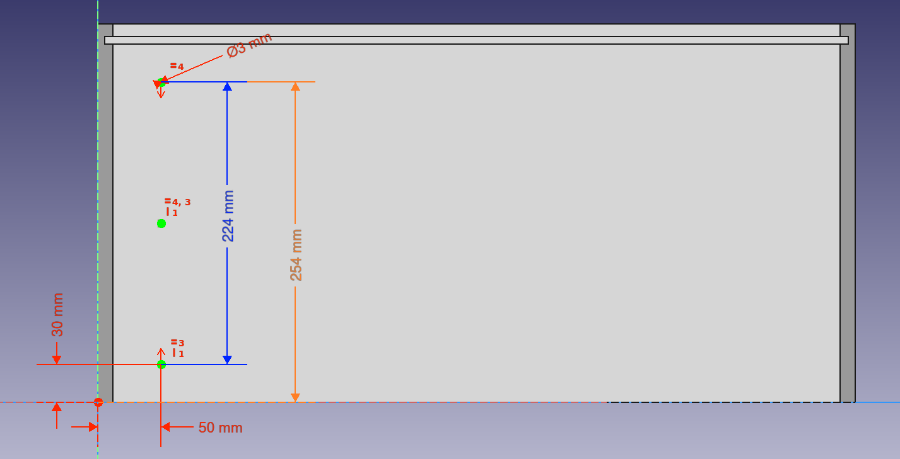

* Attachment  
  * Support: **DatumPlane**  
* Huller
  * Placer 3 huller lodret over hinanden, med samme afstand
    * Contrain Vertically
    * Constrain Symmetrical
  * Hulcenter afstand fra top eller bund: **50mm**
  * Hulcenter afstand fra forkant & Bagbeklædning: **30mm**
  * Hulcenter afstand mellem yderste huller :  **300-10-6-30-30 = 224mm**
  * HulDiameter: **3mm**

### [ PartDesign_Pocket - Pocket001](https://wiki.freecad.org/PartDesign_Pocket) 

* Pocket parameter
  * Type: **Dimension**
  * Length: **6,5mm**
  * Direction
    * Direction/egde: **Sketch normal**
    * Show direction: **Not Checked**
    * Length along sketch normal: **Checked**
  * Symmetric to plane: **Not Checked**
  * Reversed: **Not Checked**
  * Taper angle: **0,00°**
  * Update view: **Checked**

### [ PartDesign_LinearPattern](https://wiki.freecad.org/PartDesign_LinearPattern)

  

* LinearPattern parameters  
  * Feature: **Pocket001**  
  * Direction: **Horizontal sketch axis**
  * Reverse direction: **Not Checked**
  * Length: **500,00mm (600-50-50)**
  * Occurrences: **21**
  * Update view: **Checked**

## [ PartDesign_Body - SkabsBund](https://wiki.freecad.org/PartDesign_Body)  

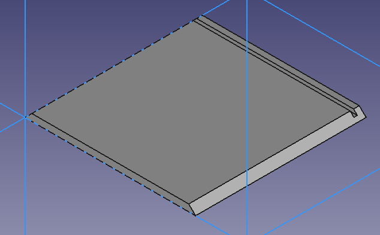

### [ Sketcher_New - Skech003](https://wiki.freecad.org/Sketcher_NewSketch)

* Attachment  
  * Support: **XZ_Plane001**  
* Skabs bredde: **300mm**
* plade tykelse: **12mm**
* vinkel i højre og venstre: **45°**

### [ PartDesign_Pad - Pad001](https://wiki.freecad.org/PartDesign_Pad)

* Pad parameter
  * Type: **Dimention**
  * Length: **300mm**
  * Direction
    * Direction/egde: **Sketch normal**
    * Show direction: **Not Checked**
    * Length along sketch normal:  **Checked**
  * Symmetric to plane: **Not Checked**
  * Reversed: **Checked**
  * Taper angle: **0,00°**
  * Update view: **Checked**

### [ Sketcher_New - Pocket002 Sketch004](https://wiki.freecad.org/Sketcher_NewSketch)

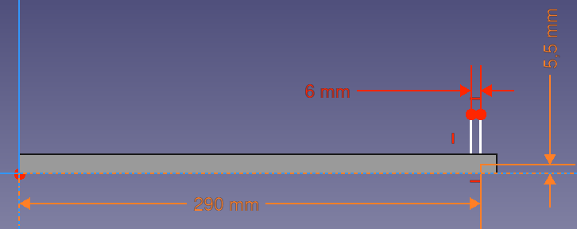

* Attachment  
  * Support: **XZ_Plane**  
* Ydre kant på pocket: 300mm - 10mm = 290mm
  * skabsdybde: **300mm**
  * bagbeklædning afstand fra bagkant: **10mm**
  * bagbeklæbnings tykkelse: **6mm**

### [ PartDesign_Pocket - Pocket002](https://wiki.freecad.org/PartDesign_Pocket) 

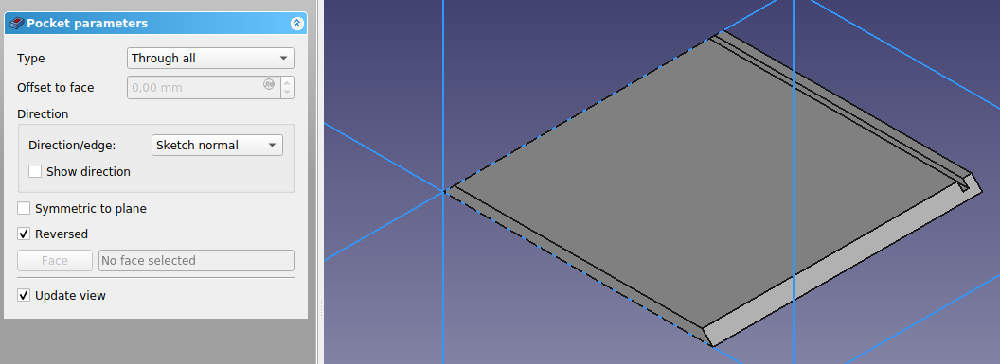

* Pocket parameter
  * Type: **Through all**
  * Offset to face:
  * Direction
    * Direction/egde: **Sketch normal**
    * Show direction: **Not Checked**
  * Symmetric to plane: **Not Checked**
  * Reversed: **Checked**
  * Update view: **Checked**

## Body_SkabsBagbeklædning

### Pad002 Sketch005

* Attachment  
  * Support: **XZ_Plane002**  
* Mål
  * Dybde: **288mm (300-6-6)**
  * Højde: **600mm (600-6-6)**

### Pad002

* Pad parameter
  * Type: **Dimention**
  * Length: **6,00mm**
  * Direction
    * Direction/egde: **Sketch normal**
    * Show direction: **Not Checked**
    * Length along sketch normal:  **Checked**
  * Symmetric to plane: **Not Checked**
  * Reversed: **Checked**
  * Taper angle: **0,00°**
  * Update view: **Checked**

## Body_SkabsHylde

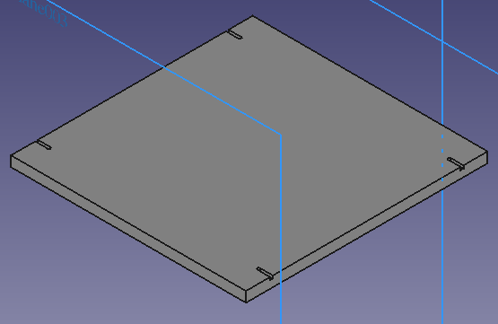  

### Pad002 Sketch005

* Attachment  
  * Support: **XZ_Plane003**  
* Mål
  * HyldeBedde: **276mm (300-12-12)**
  * HyldeDybde: **284mm (300-10-6)**

### Pad003

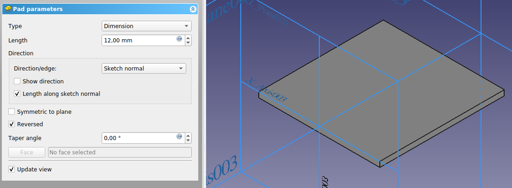

* Pad parameter
  * Type: **Dimention**
  * Length: **12,00mm**
  * Direction
    * Direction/egde: **Sketch normal**
    * Show direction: **Not Checked**
    * Length along sketch normal:  **Checked**
  * Symmetric to plane: **Not Checked**
  * Reversed: **Checked**
  * Taper angle: **0,00°**
  * Update view: **Checked**

### Pocket003 Sketch007

* Attachment  
  * Support: **XZ_Plane003**  
* Mål
  * Slot Afstand fra Kant: **30mm**
  * Slot Diameter: **3,20mm**
  * Afstand mellem Slot: **224mm (300-10-6-30-30)**
  * Slot Afstand fra kant: **15mm ((300-12-12)/2-15)**

### Pocket003

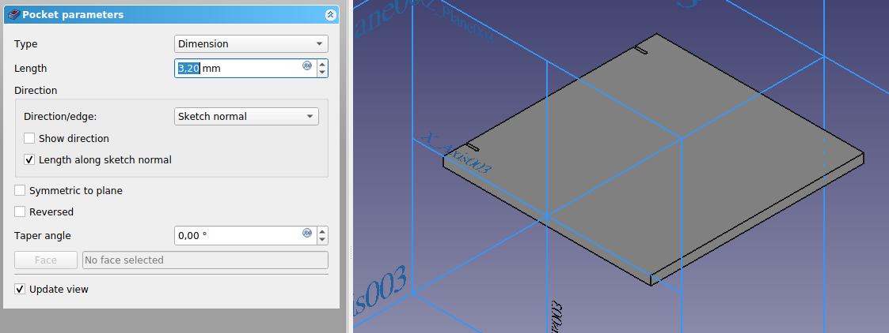

* Pocket parameter
  * Type: **Dimension**
  * Length: **3,2mm**
  * Direction
    * Direction/egde: **Sketch normal**
    * Show direction: **Not Checked**
    * Length along sketch normal: **Checked**
  * Symmetric to plane: **Not Checked**
  * Reversed: **Not Checked**
  * Taper angle: **0,00°**
  * Update view: **Checked**

### Mirrored

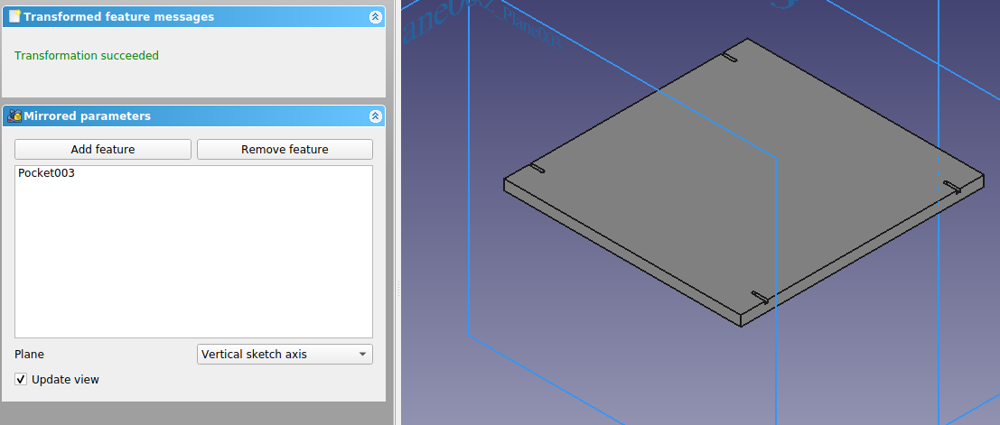

* Mirrored parameters
  * Feature: **Pocket003**
  * Plane: **Vertical sketch axis**
  * Update view: **Checked**
