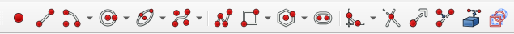
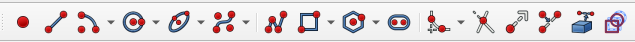
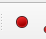
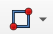
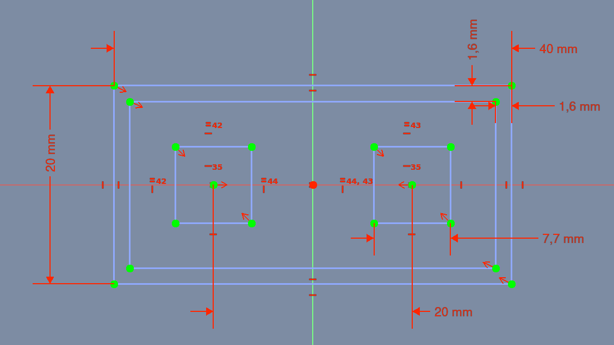
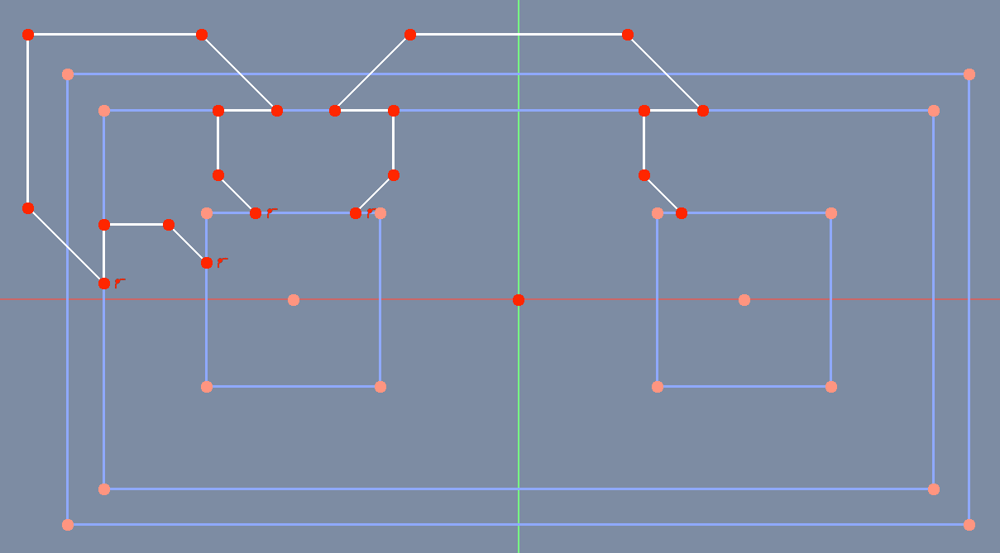
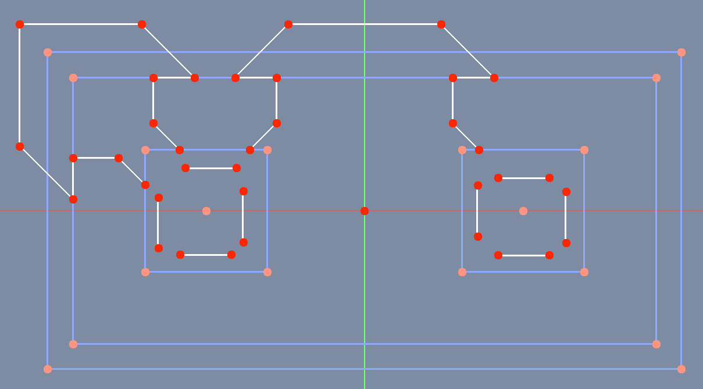

# Opgave 002 Part Design AluminiumProfile  

I denne opgave skal vi tegne en aluminium profil:  

## Opret ny opgave

* Klik på
  * File -> New

### Gem opgaven i ./Dokumenter/FreeCAD/Opgave_002

* File -> Save As
  * Vælg mappen Dokumenter 
    * Klik på **Create New Folder**
      * Navngiv den nye Folder **FreeCAD**
      * File name: Opgave_002
      * 
      * Klik **Save**

## [ PartDesign_Body - AluProfile](https://wiki.freecad.org/PartDesign_Body)  

### [ PartDesign NewSketch - Sketch](https://wiki.freecad.org/Sketcher_NewSketch)

* Attachment  
  * Support: **XZ_Plane**  
* Klik [ OK ]

### Step 001 Sæt Sketcher til Construction Geometry mode

* 001 Klik Toggle construction geometry  skifter fra Sketcher geometry som vist herunder
  * fra
    * 
  * til
    * 

### Step 002 Tegn med Sketcher's Construction Geometry værktøjer

* Sketcher construction geometry værktøjer
  * 
  * 
* Brug følgende Sketcher Geometric constraints
  * 
  * 
  *  
* Brug følgende Sketcher Geometric constraints
    * 
  * 

* Med de værktøjer som vis ovenfor skal du fremstille en figur som denne vist herunder
  * 

### Step 003 Tegn med Sketcher's Geometry værktøjer

* 

### Step 004 Tegn med Sketcher's Geometry værktøjer

*   

### Step 005 Tegn med Sketcher's Geometry værktøjer

*   

### Step 006 Tegn med Sketcher's Geometry værktøjer

*   
