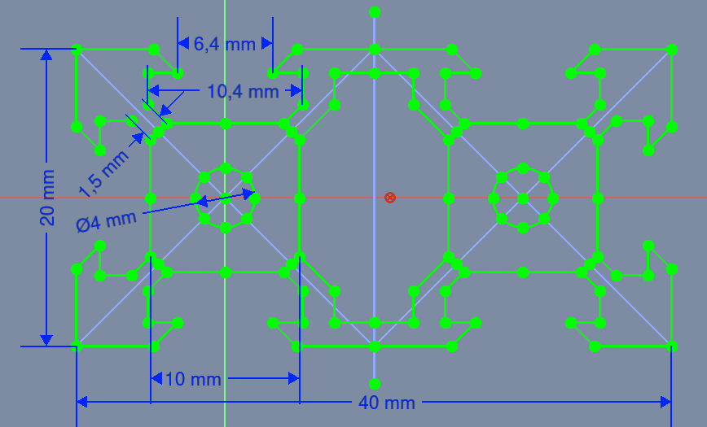
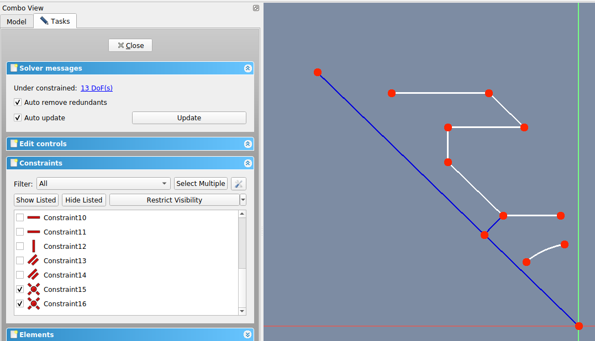
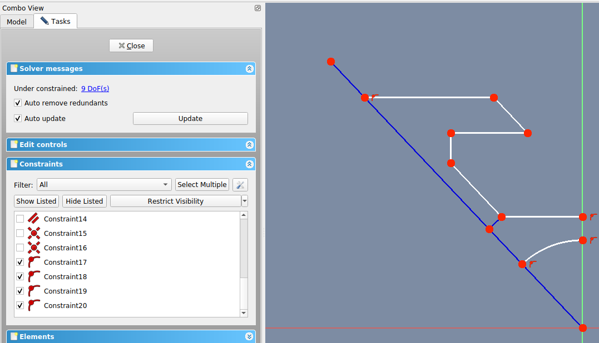
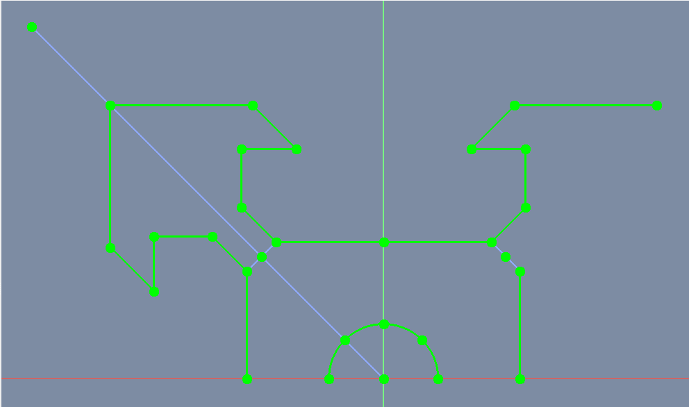
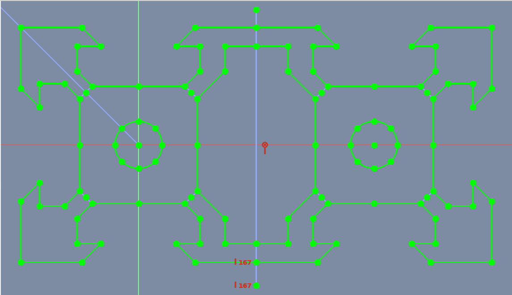

#  Sketcher Symmetry - Geometric & Dimensional constraints

##  [Sketcher Symmetry](https://wiki.freecadweb.org/Sketcher_Symmetry)

* Menuens placering: **Sketch → Sketcher tools → Symmetry**
* Standard genvej: **[Z],[S]**
* Beskrivelse: Spejler skitserer geometri med reference til en valgt linje eller skitseakse.
* Brug: 
  1. Vælg den geometri, der skal kopieres, og derefter en linje- eller skitseakse, der skal bruges som symmetriaksen.
  2. Tryk på Sketcher Symmetry-knappen eller vælg: **Sketch → Sketcher-værktøjer → Sketcher Symmetry** fra topmenuen.
  3. Den valgte geometri vil blive kopieret symmetrisk til den valgte linje eller skitseakse.  
  !! Bemærk, at der ikke tilføjes nogen ekstra symmetribegrænsning.

## Sketcher Tools, Geometries, Constraints brugt i denne opgave

* Tools
  *  [Symmetry:](https://wiki.freecadweb.org/Sketcher_Symmetry)  Kopierer et skitseelement symmetrisk til en valgt linje.
* Geometries
  *  [Line:](https://wiki.freecadweb.org/Sketcher_CreateLine)  Tegner et linjestykke mellem 2 punkter. Linjer er uendelige med hensyn til visse begrænsninger.
  *  [Create an arc](https://wiki.freecadweb.org/Sketcher_CompCreateArc) Tegner et buesegment fra centrum, radius, startvinkel og slutvinkel.
  *  [Polyline](https://wiki.freecadweb.org/Sketcher_CreatePolyline) Tegner en linje lavet af flere linjestykker.
  *  [Toggle construction geometry:](https://wiki.freecadweb.org/Sketcher_ToggleConstruction) Skifter skitsegeometri fra/til konstruktionstilstand. Konstruktionsgeometri er vist i blåt og kasseres uden for skitseredigeringstilstand.

* Geometric constraints
  *  [Coincident:](https://wiki.freecadweb.org/Sketcher_ConstrainCoincident) Sætter et punkt på (sammenfaldende med) et eller flere andre punkter.
  *  [Point on Object:](https://wiki.freecadweb.org/Sketcher_ConstrainPointOnObject) Sætter et punkt på et andet objekt såsom en linje, bue eller akse.
  *  [Vertical](https://wiki.freecadweb.org/Sketcher_ConstrainVertical) Begrænser de valgte linjer eller polylinjeelementer til en ægte lodret orientering. Mere end ét objekt kan vælges, før denne begrænsning anvendes.
  *  [Horizontal](https://wiki.freecadweb.org/Sketcher_ConstrainHorizontal) Begrænser de valgte linjer eller polylinjeelementer til en ægte vandret orientering. Mere end ét objekt kan vælges, før denne begrænsning anvendes.
  *  [Parallel](https://wiki.freecadweb.org/Sketcher_ConstrainParallel) Constrains two or more lines parallel to one another.
  *  [Perpendicular](https://wiki.freecadweb.org/Sketcher_ConstrainPerpendicular) Constrains two lines perpendicular to one another, or constrains a line perpendicular to an arc endpoint.
  *  [Block:](https://wiki.freecadweb.org/Sketcher_ConstrainBlock) it blocks an edge from moving, that is, it prevents its vertices from changing their current positions. It should be particularly useful to fix the position of B-Splines. 
* Dimensional constraints
  *  [Horizontal Distance:](https://wiki.freecadweb.org/Sketcher_ConstrainDistanceX) Fixer den vandrette afstand mellem to punkter eller linjeslutpunkter. Hvis kun ét element er valgt, indstilles afstanden til oprindelsen.
  *  [Vertical Distance:](https://wiki.freecadweb.org/Sketcher_ConstrainDistanceY) Fixer den lodrette afstand mellem 2 punkter eller linjeslutpunkter. Hvis kun ét element er valgt, indstilles afstanden til oprindelsen.
  *  [Distance:](https://wiki.freecadweb.org/Sketcher_ConstrainDistance) Definerer afstanden af en valgt linje ved at begrænse dens længde, eller definerer afstanden mellem to punkter ved at begrænse afstanden mellem dem.
  *  [Diameter:](https://wiki.freecadweb.org/Sketcher_ConstrainDiameter) Definerer diameteren af en valgt bue eller cirkel ved at begrænse diameteren.
  *  [Angle:](https://wiki.freecadweb.org/Sketcher_ConstrainAngle) Definerer den indre vinkel mellem to valgte linjer.

## Her er billeder af de to typer Alu-Profiler som vi skal prøve at tegne

* 20x20x100mm Profil
* 20x40x100mm Profil

På de to tegninger herunder, har jeg indtastet de mål, vi har taget med en skydelærer, ud fra dem skulle det være en smal sag at tegne disse profiler. Som det fremgår at tegningerne er der rigtig mange symetri linier i profilerne, så lad os udnytte dette.

| Profil | Sketch | Pad |
| ---  | --- | --- |
|20x20 | |  |
|20x40 |  |  |

## Konstruktionsgeometri

Vi skal starte med at tegne et 45deg udsnit af vores Alu-profil, så derfor opretter vi et par konstruktions linier. Senere kan vi så spejle vores tegning over denne linie.

* Vi starter med at tegne 2 construction linier
  1. Klik  så skifter skitsegeometri fra/til konstruktionstilstand. Konstruktionsgeometri er vist i **blåt** og kasseres uden for skitseredigeringstilstand.
  2. vælg  Line geometries tool til at tegne Konstruktionslinierne med med.
  3. Den første linie skla gå fra nul punkt (0.0,0.0) til ca. (15.0, 135.0 deg).
  4. næste linie skal starte ca. i (-4.0, 5.0), og slutte med vinkelret på den første line. Brug  Perpendicular constrain til at låse linien.
  5. Se billedet **Konstruktionsgeometri** herunder til venstre.

|Konstruktionsgeometri Combo View -> Task -> Constrains|
| --- |
||

## Sketch Start

* Klik  så skifter skitsegeometri fra konstruktionstilstand. 
  * Brug nu  og , til at tegne et 45 graders udsnit af vores Alu-Profile.
  * Se **Sketch Start** herunder

|Sketch Start|
| --- |
||

## Geometric  Horizontal constraints &  Vertical constraints

* 3 Horizontal & 1 Vertical constraints
  * Brug nu  Horizontal constraints  &  Vertical constraints, så vi får låst alle vandrette og lodrette linier.
  * Se billedet herunder til venstre:

|Geometric constraints: (3 Horizontal, 1 Vertical)
|--- |
|

## Geometric  Parallel constraints

* 2 Parallel constraints
  * brug nu  Parallel constraints til at få styr på de to skrå linier.
  * Se billedet herunder til højre:

|Geometric constraints: (2 Parallel)
|--- |
|

## Geometric  Coincident constraints

* 2 Coincident  constraints
  * Brug nu  **Coincident  constraints** til at låse 3 punkter.
  * Se billedet herunder til venstre:

|Geometric constraints: (2 Coincident)|
|--- |
||

## Geometric  Point on object constraints

* 4 Point on object
  * Brug nu   til at få låst de sidste 4 punkter.
  * Se billedet herunder til højre:

|Geometric constraints: (4 Point on object)|
|--- |
||

## Datums  Distance Constraints

* 1 Datum Distance (1,5mm / 2) Constrain
  * Brug nu  **Distance Constrain**

|Datum Distance Constraints: (1,5mm / 2)|
|--- |
||

## Datums  Horizontal Distance Constraints

* 2 Horizontal distance (6,4mm / 2) & (10,4mm / 2)
  * Brug nu  **Horizontal Distance Constrain**

|Datum Horizontal distance constraints (6,4mm / 2) & (10,4mm / 2)|
|--- |
||

## Datums  Vertical Distance Constraints

* 3 Datum Vertical Distance Constrain på 1,6mm & 5,0mm & 10,0mm
  * Brug nu  **Vertical Distance Constrain**

|Datum Vertical distance constraints på 1,6mm & 5mm & 10mm|
|--- |
||

## Datums  Diameter constraints

* 1 Datum Diameter Constrain på 4mm
  * Brug nu  **Diameter Constrain**

|Datum Diameter Constraints på 4mm|
|--- |
||

## Datum  Angle Constrain

* Lås nu konstruktions linien med  **Angle constrain** til en vinklen på 45deg i forhold til Y_Axis.  

|Datum Angle Constraints på 45deg|
|--- |
||

## Geometric Block constraints

* 9 Block
  * Brug nu  **Block Constrain**, vi skal bruge Block constrain for at holde vore sketh fully constrain efter Sketcher_Symmetry værktøjet.

|Datums 9 Block Constraints|
|--- |
||

## Sketcher_Symmetry 20x20x100 Profile

|Fully Constrained  & Selected sketch|Sketcher_Symmetry over Konstruktionslinie  Sketch->Sketcher Tools->Symmetry [Z],[S]|
| --- | --- |
||||

|Symmetry over Y_Axis|
| --- |
||

|Symmetry over X_Axis|
| --- |
|

|Symmetry 20x20x100 Pad|
| --- |
||

## Sketcher_Symmetry 20x40x100 Profile

|Fully Constrained  & Selected sketch|Sketcher_Symmetry over Konstruktionslinie  Sketch->Sketcher Tools->Symmetry [Z],[S]|
| --- | --- |
||||

|Symmetry over Y_Axis|
| --- |
||

## Ret i Sketch, Slet liner og opret nye

|Slettet Linier|
| --- |
||

|Nye Linier|
| --- |
||

|Symmetry over X_Axis|
| --- |
||

|Symmetry over konstruktions linie|
| --- |
||

## Pad

|Symmetry 20x40x100 Pad|
| --- |
||

