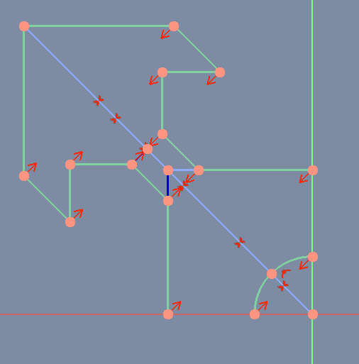

# Sketcher Symmetry og Sketcher ConstrainSymmetric

##  [Sketcher Symmetry](https://wiki.freecadweb.org/Sketcher_Symmetry)

### Beskrivelse

Spejle skitserer geometri med reference til en valgt linje eller skitseakse.

### Brug

Vælg den geometri, der skal kopieres, og derefter en linje- eller skitseakse, der skal bruges som symmetriaksen.  
Tryk på  Symmetry-knappen eller vælg Sketch → Sketcher-værktøjer → Sketcher Symmetry.svg Symmetry fra topmenuen.  
Den valgte geometri vil blive kopieret symmetrisk til den valgte linje eller skitseakse.  

!! Bemærk, at der ikke tilføjes nogen ekstra symmetribegrænsning.

##  [Sketcher ConstrainSymmetric](https://wiki.freecadweb.org/Sketcher_ConstrainSymmetric)

### Beskrivelse

Den symmetriske begrænsning begrænser to udvalgte punkter til at være symmetriske omkring en given linje, dvs. begge valgte punkter er begrænset til at ligge på en normal på linjen gennem begge punkter og er begrænset til at være ækvidistante fra linjen.

Alternativt kan den begrænse to punkter til at være symmetriske i forhold til et tredje.

### Brug

Se og prøv eksemplerne på [denne side](https://wiki.freecadweb.org/Sketcher_ConstrainSymmetric)

## Eksempler

### 1. Sketcher Symmetry

| Sketcher Symmetry | Sketcher ConstrainSymmetric |
| --- | --- |
|||

