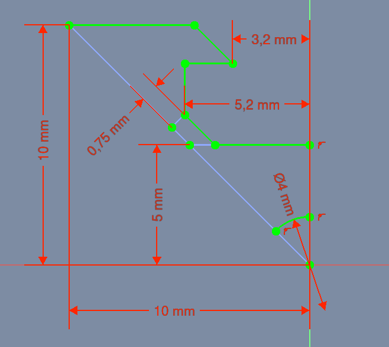

# Sketcher Symmetry og Sketcher ConstrainSymmetric

##  [Sketcher Symmetry](https://wiki.freecadweb.org/Sketcher_Symmetry)

Spejle skitserer geometri med reference til en valgt linje eller skitseakse.

!! Bemærk, at der ikke tilføjes nogen ekstra symmetribegrænsning.

##  [Sketcher ConstrainSymmetric](https://wiki.freecadweb.org/Sketcher_ConstrainSymmetric)

Den symmetriske begrænsning begrænser to udvalgte punkter til at være symmetriske omkring en given linje, dvs. begge valgte punkter er begrænset til at ligge på en normal på linjen gennem begge punkter og er begrænset til at være ækvidistante fra linjen.  
Alternativt kan den begrænse to punkter til at være symmetriske i forhold til et tredje.

##  [Sketcher ConstrainBlock](https://wiki.freecadweb.org/Sketcher_ConstrainBlock)

Constrain Block blokerer et geometrisk element på plads med en enkelt begrænsning.  
Det er hovedsageligt beregnet til at blive brugt sammen med Sketcher CreateBSpline.svg B-splines, som ellers kan være vanskelige helt at begrænse.

## Sketch

Her ser vi en **fully constrained** FreeCAD sketch af vores alu-profil.  
[FreeDAD-filen kan hentes ved at klikke her](./SketcherSymmetry.FCStd).  
Hent filen og fortsæt ved næste punkt.

## Sketcher Symmetry

Efter at have brugt  Sketcher Symmetry værktøj, ser vi at vores vores sketch ikke længere er fully constrained,  
jeg ser to måder at opnå en fully constrained sketch igen.

1. Bruge  Sketcher ConstrainSymmetric
2. Bruge  Sketcher ConstrainBlock

### 1. Sketcher ConstrainSymmetric

| Sketcher Symmetry | Sketcher ConstrainSymmetric |
| --- | --- |
|||

Når vi bruger denne fremgangs måde opdager vi at to andre værktøjer også er nødvendige, nemlig.

1.  [Sketcher_ConstrainCoincident](https://wiki.freecadweb.org/Sketcher_ConstrainCoincident), som sætter et punkt på (sammenfaldende med) et eller flere andre punkter.
2.  [Sketcher_ConstrainPointOnObject](https://wiki.freecadweb.org/Sketcher_ConstrainPointOnObject), som sætter et punkt på et andet objekt såsom en linje, bue eller akse.

### 2. Sketcher ConstrainBlock

| Sketcher Symmetry | Sketcher ConstrainBlock |
| --- | --- |
|||

Bruger vi denne fremgangsmåde skal vi kun bruge  Sketcher ConstrainBlock for at opnå en fully constrained sketch.
