#  Sketcher Symmetry - Geometric & Dimensional constraints

## 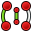 [Sketcher Symmetry](https://wiki.freecadweb.org/Sketcher_Symmetry)

* Menuens placering: **Sketch → Sketcher tools → Symmetry**
* Standard genvej: **[Z],[S]**
* Beskrivelse: Spejler skitserer geometri med reference til en valgt linje eller skitseakse.
* Brug: 
  1. Vælg den geometri, der skal kopieres, og derefter en linje- eller skitseakse, der skal bruges som symmetriaksen.
  2. Tryk på Sketcher Symmetry-knappen eller vælg: **Sketch → Sketcher-værktøjer → Sketcher Symmetry** fra topmenuen.
  3. Den valgte geometri vil blive kopieret symmetrisk til den valgte linje eller skitseakse.  
  !! Bemærk, at der ikke tilføjes nogen ekstra symmetribegrænsning.

## Sketcher Tools, Geometries, Constraints brugt i denne opgave

* Tools
  *  [Symmetry:](https://wiki.freecadweb.org/Sketcher_Symmetry)  Kopierer et skitseelement symmetrisk til en valgt linje.
* Geometries
  *  [Line:](https://wiki.freecadweb.org/Sketcher_CreateLine)  Tegner et linjestykke mellem 2 punkter. Linjer er uendelige med hensyn til visse begrænsninger.
  *  [Create an arc](https://wiki.freecadweb.org/Sketcher_CompCreateArc) Tegner et buesegment fra centrum, radius, startvinkel og slutvinkel.
  *  [Polyline](https://wiki.freecadweb.org/Sketcher_CreatePolyline) Tegner en linje lavet af flere linjestykker.
  *  [Toggle construction geometry:](https://wiki.freecadweb.org/Sketcher_ToggleConstruction) Skifter skitsegeometri fra/til konstruktionstilstand. Konstruktionsgeometri er vist i blåt og kasseres uden for skitseredigeringstilstand.

* Geometric constraints
  *  [Coincident:](https://wiki.freecadweb.org/Sketcher_ConstrainCoincident) Sætter et punkt på (sammenfaldende med) et eller flere andre punkter.
  *  [Point on Object:](https://wiki.freecadweb.org/Sketcher_ConstrainPointOnObject) Sætter et punkt på et andet objekt såsom en linje, bue eller akse.
  *  [Vertical](https://wiki.freecadweb.org/Sketcher_ConstrainVertical) Begrænser de valgte linjer eller polylinjeelementer til en ægte lodret orientering. Mere end ét objekt kan vælges, før denne begrænsning anvendes.
  *  [Horizontal](https://wiki.freecadweb.org/Sketcher_ConstrainHorizontal) Begrænser de valgte linjer eller polylinjeelementer til en ægte vandret orientering. Mere end ét objekt kan vælges, før denne begrænsning anvendes.
  *  [Parallel](https://wiki.freecadweb.org/Sketcher_ConstrainParallel) Constrains two or more lines parallel to one another.
  *  [Perpendicular](https://wiki.freecadweb.org/Sketcher_ConstrainPerpendicular) Constrains two lines perpendicular to one another, or constrains a line perpendicular to an arc endpoint.
  *  [Block:](https://wiki.freecadweb.org/Sketcher_ConstrainBlock) it blocks an edge from moving, that is, it prevents its vertices from changing their current positions. It should be particularly useful to fix the position of B-Splines. 
* Dimensional constraints
  *  [Horizontal Distance:](https://wiki.freecadweb.org/Sketcher_ConstrainDistanceX) Fixer den vandrette afstand mellem to punkter eller linjeslutpunkter. Hvis kun ét element er valgt, indstilles afstanden til oprindelsen.
  *  [Vertical Distance:](https://wiki.freecadweb.org/Sketcher_ConstrainDistanceY) Fixer den lodrette afstand mellem 2 punkter eller linjeslutpunkter. Hvis kun ét element er valgt, indstilles afstanden til oprindelsen.
  *  [Distance:](https://wiki.freecadweb.org/Sketcher_ConstrainDistance) Definerer afstanden af en valgt linje ved at begrænse dens længde, eller definerer afstanden mellem to punkter ved at begrænse afstanden mellem dem.
  *  [Diameter:](https://wiki.freecadweb.org/Sketcher_ConstrainDiameter) Definerer diameteren af en valgt bue eller cirkel ved at begrænse diameteren.
  *  [Angle:](https://wiki.freecadweb.org/Sketcher_ConstrainAngle) Definerer den indre vinkel mellem to valgte linjer.

## Her er billeder af de to typer Alu-Profiler som vi skal prøve at tegne

* 20x20x100mm Profil
* 20x40x100mm Profil

På de to tegninger herunder, har jeg indtastet de mål, vi har taget med en skydelærer, ud fra dem skulle det være en smal sag at tegne disse profiler. Som det fremgår at tegningerne er der rigtig mange symetri linier i profilerne, så lad os udnytte dette.

| Profil | Sketch | Pad |
| ---  | ---    | --- |
|20x20 | 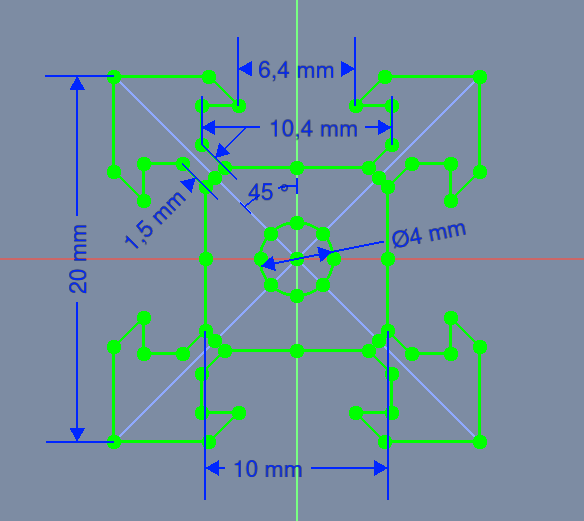 | 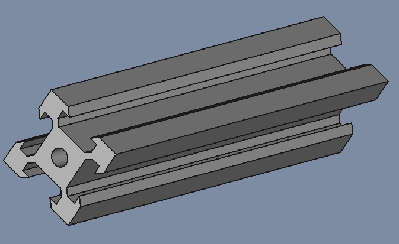 |
|20x40 |  | 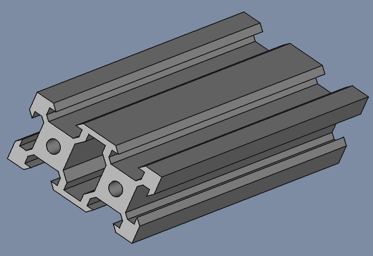 |

* Vi starter med at tegne 2 construction linier
  1. Klik  så skifter skitsegeometri fra/til konstruktionstilstand. Konstruktionsgeometri er vist i blåt og kasseres uden for skitseredigeringstilstand.
  2. vælg  Line geometries tool til at tegne Konstruktionsgeometrien med.
  3. en linie med (x,y kordinaterne) (0,0) til (-10,10)
  4. næste linie skal være Perpendicular til første linie og have endpunkt i (y=5mm), med en længde på: 1,5mm/2
  5. Se Sketch herunder

| Konstruktionsgeometri |
| --- |
|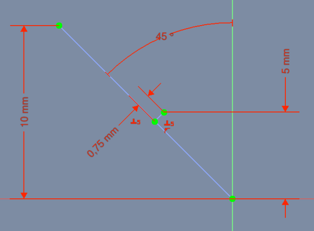|

* Klik  så skifter skitsegeometri fra/til konstruktionstilstand. 
  * 

|Geometric constraints: (3 Horizontal, 1 Vertical)|Geometric constraints: (2 Parallel)|
|--- |--- |
|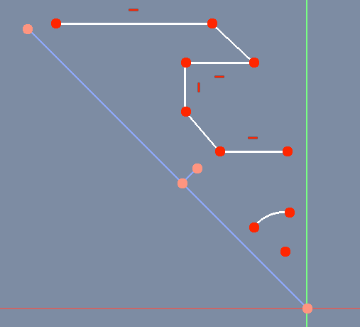|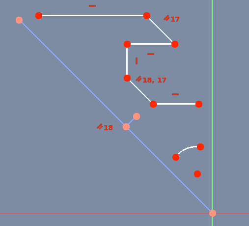|

|Geometric constraints: (3 Coincident)|Geometric constraints: (3 Point on object)|
|--- |--- |
|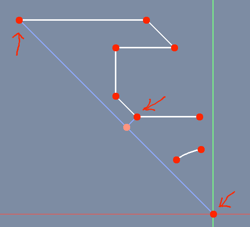|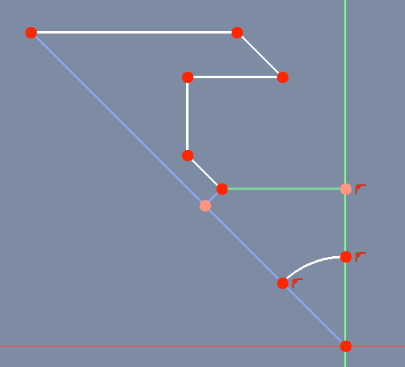|

|Datums constraints (2 Horizontal distance, 1 Vertical distance, 1 Radius)|Geometric constraints: (9 Block) |
|--- |--- |
|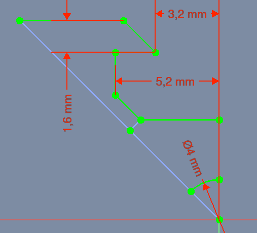||

## Sketch

Her ser vi en **fully constrained** FreeCAD sketch af vores alu-profil.  
[FreeDAD-filen kan hentes ved at klikke her](./SketcherSymmetry.FCStd).  
Hent filen og fortsæt ved næste punkt.

## Sketcher Symmetry

Efter at have brugt  Sketcher Symmetry værktøj, ser vi at vores vores sketch ikke længere er fully constrained,  
jeg ser to måder at opnå en fully constrained sketch igen.

1. Bruge  Sketcher ConstrainSymmetric
2. Bruge  Sketcher ConstrainBlock

### 1. Sketcher ConstrainSymmetric

| Sketcher Symmetry | Sketcher ConstrainSymmetric |
| --- | --- |
|||

Når vi bruger denne fremgangs måde opdager vi at to andre værktøjer også er nødvendige, nemlig.

1.  [Sketcher_ConstrainCoincident](https://wiki.freecadweb.org/Sketcher_ConstrainCoincident), som sætter et punkt på (sammenfaldende med) et eller flere andre punkter.
2.  [Sketcher_ConstrainPointOnObject](https://wiki.freecadweb.org/Sketcher_ConstrainPointOnObject), som sætter et punkt på et andet objekt såsom en linje, bue eller akse.

### 2. Sketcher ConstrainBlock

| Sketcher Symmetry | Sketcher ConstrainBlock |
| --- | --- |
||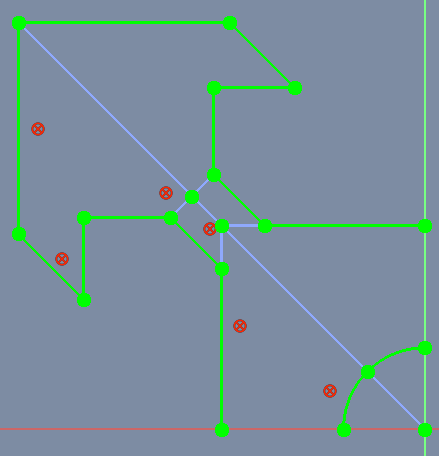|

Bruger vi denne fremgangsmåde skal vi kun bruge  Sketcher ConstrainBlock for at opnå en fully constrained sketch.

### 3. Sketcher Symmetry over Y- & X-Axis

| Sketch-Symmetry over Y_Axis | Sketch-Symmetry over X_Axis |
| --- | --- |
|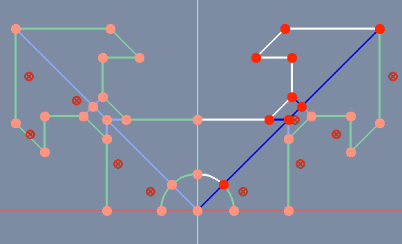|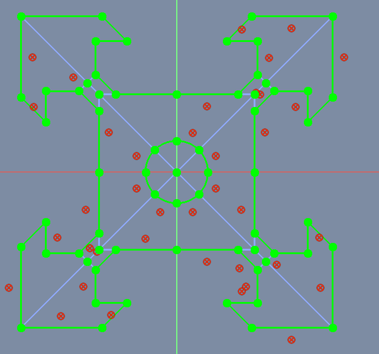|

### 4. Sketcher Symmetry over construction geometry

| Sketch-Symmetry over construction geometry |
| --- |
|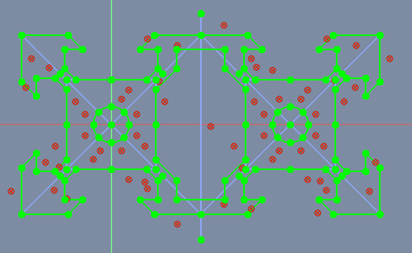|

### 5. Pad Symmetry 

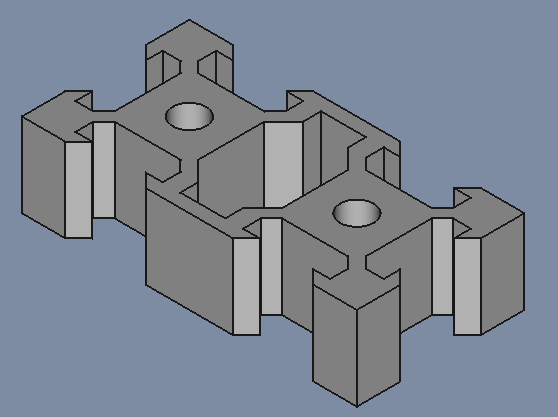
