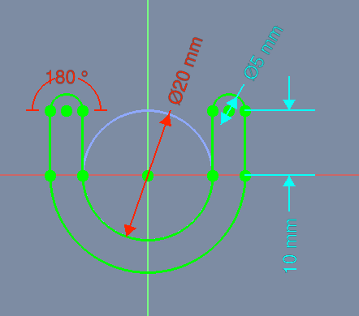
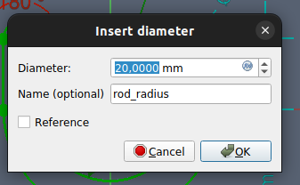
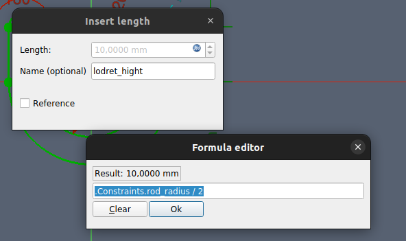
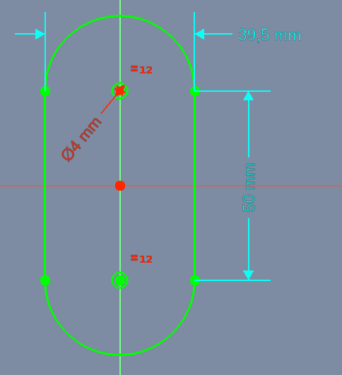
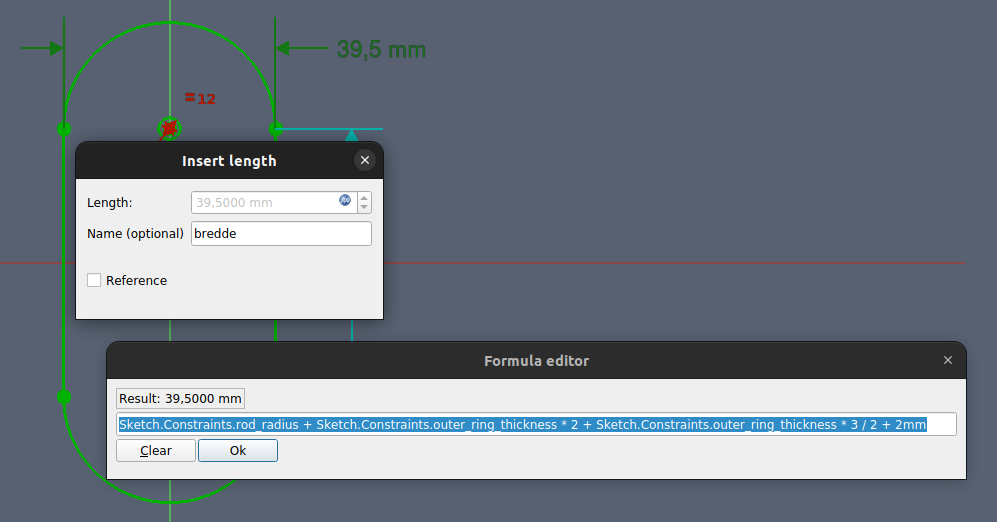
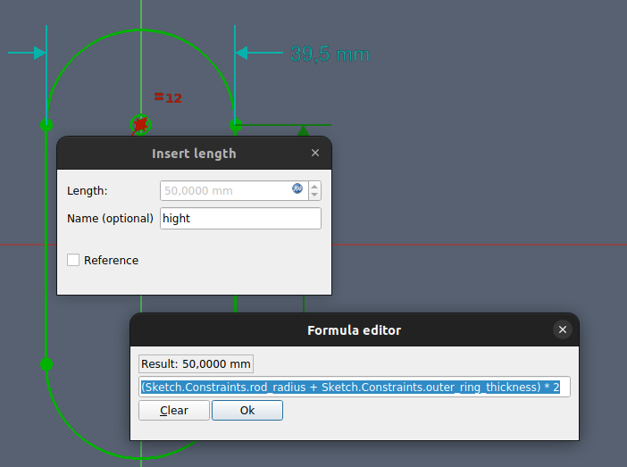

# Opgave 007 - Simple fully parametric design with named constraints

Kilde: https://forum.freecadweb.org/viewtopic.php?t=51668

## Slutresultat

## Sketch
  

### Sketch_rod_radius 

* Diameter: 20,00 mm
* Name: rod_radius  
*   

### Sketch_outer_ring_thickness

* Diameter: .Constraints.rod_radius / 4
* Name: outer_ring_thickness  
* 

## Sketch lodret højde

* Length: .Constraints.rod_radius / 2
* Name: lodret_hight  
* 

## Sketch001

## Sketch001_Bredde

* Length: Sketch.Constraints.rod_radius + Sketch.Constraints.outer_ring_thickness * 2 + Sketch.Constraints.outer_ring_thickness * 3 / 2 + 2mm
* Name: bredde
* 

## Sketch001_Højde

* Length: (Sketch.Constraints.rod_radius + Sketch.Constraints.outer_ring_thickness) * 2
* Name: hight
* 

## Sketch001_Fillet

Radius: Sketch.Constraints.outer_ring_thickness / 4

