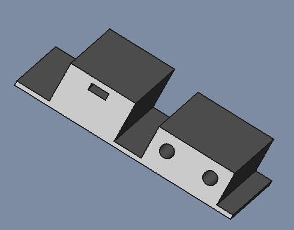
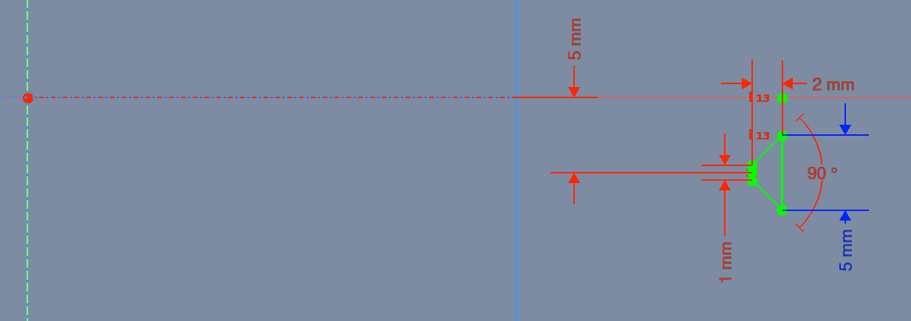
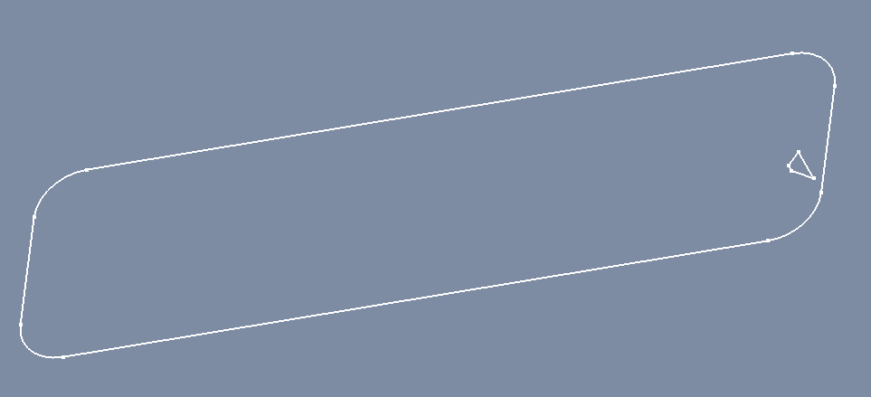
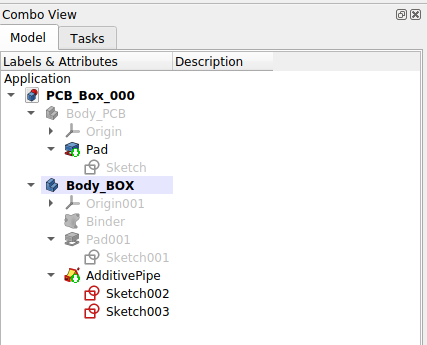
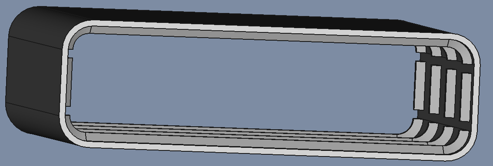
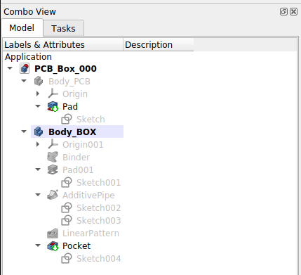

# Tegn en box for din elektronik

## Nyttige link

### Youtube Video: 
* [FreeCAD 0.20 For Beginners | 24 | Lid & Box / Enclosure | Threaded Holes Cross File Sub Shape Binder](https://www.youtube.com/watch?v=KzLWKKBtnxU&list=PLWuyJLVUNtc0UszswD0oD5q4VeWTrK7JC&index=26)

### FreeCAD using mathematical expressions
* [expressions](https://wiki.freecadweb.org/Expressions)
  * [Floor and ceiling functions](https://en.wikipedia.org/wiki/Floor_and_ceiling_functions)

## Body_PCB

|Sketch|
|:---:|
||

|Pad parameters|Pad|
|:---:|:---:| 
|||

|Combo View|
|:---:|
||

## Body_BOX

### Binder & Pad

|Sketch|
|:---:|
||

|Pad parameters|Pad|
|:---:|:---:| 
|||

|Combo View|
|:---:|
||

### AdditivePipe

|Sketch|
|:---:|
||
||
||

|Pipe parameters|AdditivePipe|
|:---:|:---:| 
|||

|Combo View|
|:---:|
||

### LinearPattern

|LinearPattern parameters|LinearPattern|
|:---:|:---:| 
|||

|Formula Length|Formula Occurrences|
|:---:|:---:| 
|||

|Combo View|
|:---:|
||

* Parameters:
  * Add feature: AdditivePipe
  * Direction: Base Z axis  
  * Reverse direction: True  
  * Length: 60,00 mm
    * Formula editor: Pad.Length
  * Occurrences: 4
    * Formula editor: ceil(Pad.Length / 15mm)

### Pocket

|Sketch|
|:---:|
||

|Pocket parameters|Pocket|
|:---:|:---:| 
|||

|Combo View|
|:---:|
||
