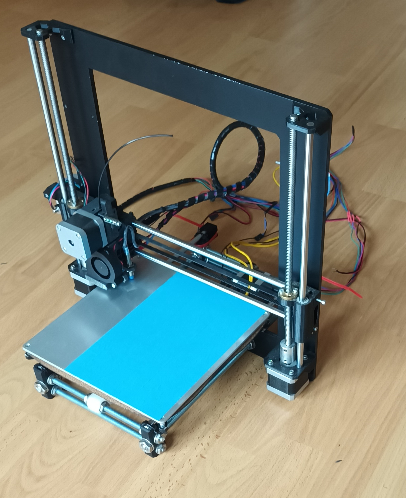

# Midtfyns Seniorværksted - FreeCad Kursus

FreeCad Kursus 2022-2023, hos [Midtfyns Seniorværksted](https://goo.gl/maps/WXFCVKzskd565Whi8)

## Forord  

Dette Repo er lavet for deltager i FreeCad 3D kursus hos Midtfyns Seniorværksted i Ringe.  
Sådan at deltager i vores kursus, kan finde opgaverne når de er kommet hjem fra kursus, og gerne vil arbejde videre; men alle som finder denne sider er velkommen til at lære fra den.  
Svenn-Erik K. Thomsen

## Nyttige Link

* [FreeCAD](https://www.freecadweb.org/)
  * [Download](https://www.freecadweb.org/downloads.php)
  * [Documentation index](https://wiki.freecad.org/)
  * [Getting started](https://wiki.freecad.org/Getting_started)
  * [The FreeCAD manual](https://wiki.freecad.org/Manual)
* FreeCad Tutorial
  * [MangoJelly Solutions](https://www.youtube.com/c/MangoJellySolutions/playlists)
    * [FreeCAD 0.20 For Beginners](https://www.youtube.com/playlist?list=PLWuyJLVUNtc0UszswD0oD5q4VeWTrK7JC)

# Mine FreeCAD Settings:

## [FreeCAD's interface, Klik Her](./FreeCAD_%20interface.md)

## [Preferences settings, Klik Her](./PreferencesSettings.md)  

## [View Toolbars settings, Klik Her](./ViewToolbarsSettings.md)

# Opgaver i PartDesign Workbench & Sketcher Workbench

I opgaverne som følger i dette afsnit skal vi bruge PartDesign & Sketcher Workbench, du kan se mere om disse værktøjer her:

* [PartDesign Workbench](https://wiki.freecad.org/PartDesign_Workbench)
* [Sketcher Workbench](https://wiki.freecad.org/Sketcher_Workbench)
* [Oprettelse af en simpel del med PartDesign](https://wiki.freecad.org/Creating_a_simple_part_with_PartDesign)
* [Grundlæggende deldesigntutorial](https://wiki.freecad.org/Basic_Part_Design_Tutorial)

## [Opgave 001, Klik Her](./Opgaver/001_PartDesign/README.md)

I opgave 001 skal vi tegne et køkken skab, i skabet skal vi tegne 1 Side_Plade, 1 Bund/Top_Plade, 1 bagbklædning og en Hylde.  
I side pladen skal vi lave huller for hylde bærer, ved hjælp af værktøjet LinearPattern.

## [Opgave 002, AluProfile Klik Her](./Opgaver/002_PartDesign-AluProfile/README.md)

I opgave 002 skal vi tegne en AluminiumsProfil so vist herunder

## [Opgave 003, Sketcher Symmetry - Geometric & Dimensional constraints](./Opgaver/003_Sketcher%20Symmetry%20-%20Geometric%20%26%20Dimensional%20constraints/README.md) 

I opgave 3 skal vi prøve om der er en nemmere måde at tegne vores Alu-Profile, vi skal prøve kræfter med **Sketcher Symmetry** og **Sketcher ConstrainSymmetric**, vi vil prøve at tegne vores alu profil ved hjælp af mirror og constrain.

## [Opgave 004, Sub_Shape_Binder, AdditivePipe & LinearPattern](./Opgaver/004_CpuBox/) 

# Ender 5 Pro Plus

## Bed Leveling Guide

* [Creality](https://www.youtube.com/@Creality3D)
  * [Creality Ender-5 Plus Bltouch Leveling Tutorial (2019)](https://www.youtube.com/watch?v=zSOVAdKw4ss)
* Kersey Fabrications
  * [Ender 5 Plus Bed Leveling Guide](https://www.youtube.com/watch?v=kdQ_0IvolnE)
  * Test Prints:
    * [200mm Simple Test Pattern / Calibration](https://www.thingiverse.com/thing:3058427)
* [Teaching Tech](https://www.youtube.com/@TeachingTech)
  * [Bed levelling for beginners to achieve a perfect first layer](https://www.youtube.com/watch?v=Ze36SX1xzOE)
    * [First layer tab of calibration website:]https://teachingtechyt.github.io/calibration.html#firstlayer)
    * [Bed Levelling X](https://www.thingiverse.com/thing:4077747) 

# 3D-Printer på vej

* [Y_Axis-MotorMount](./3D-Printer/Y_Axis/README.md)
