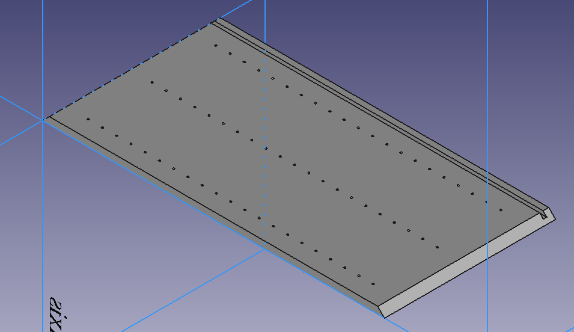
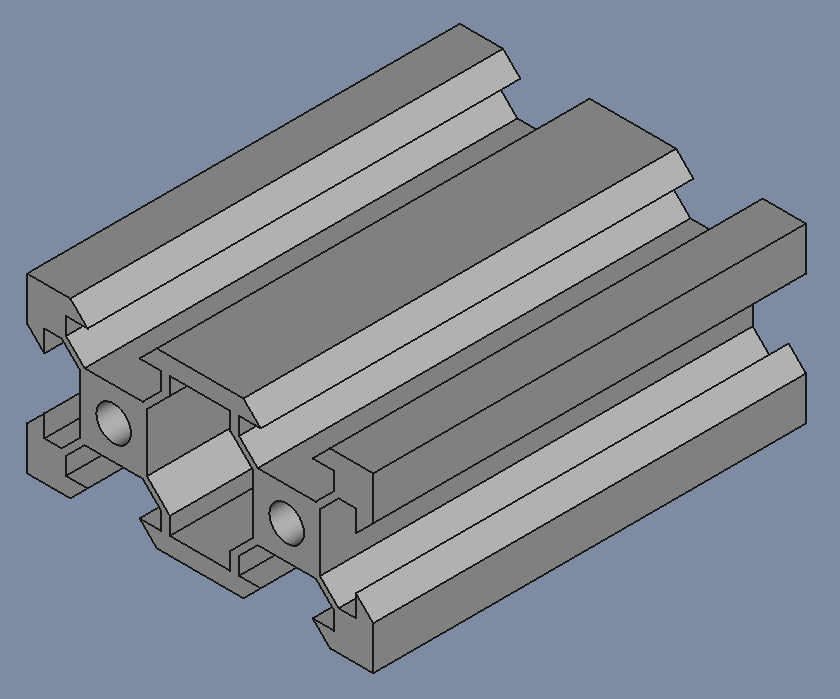
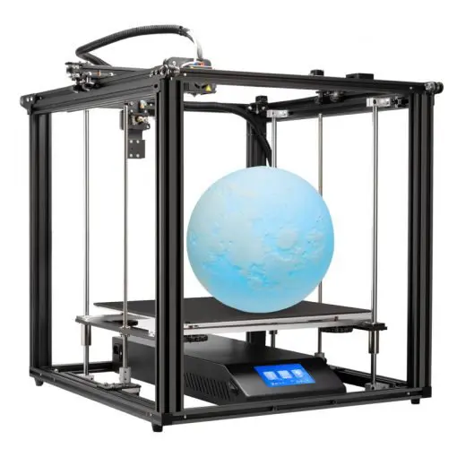
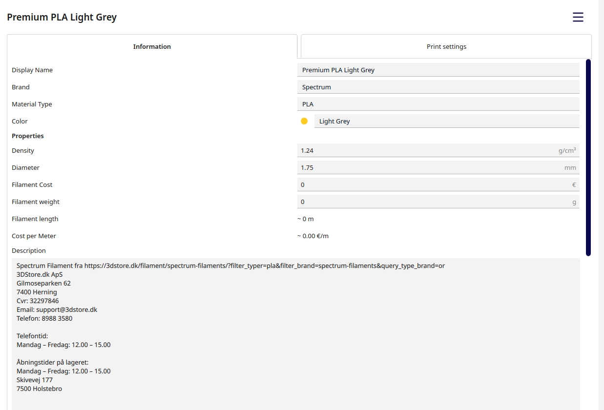
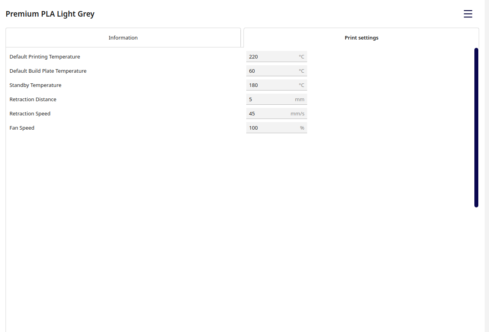

# Midtfyns Seniorværksted - FreeCad Kursus

FreeCad Kursus 2022-2023, hos [Midtfyns Seniorværksted](https://goo.gl/maps/WXFCVKzskd565Whi8)

## Forord  

Dette Repo er lavet for deltager i FreeCad 3D kursus hos Midtfyns Seniorværksted i Ringe.  
Sådan at deltager i vores kursus, kan finde opgaverne når de er kommet hjem fra kursus, og gerne vil arbejde videre; men alle som finder denne sider er velkommen til at lære fra den.  
Svenn-Erik K. Thomsen

## FreeCAD Nyttige Link

* [FreeCAD](https://www.freecadweb.org/)
  * [Download](https://www.freecadweb.org/downloads.php)
  * [Documentation index](https://wiki.freecad.org/)
  * [Getting started](https://wiki.freecad.org/Getting_started)
  * [The FreeCAD manual](https://wiki.freecad.org/Manual)
* FreeCad Tutorial
  * [MangoJelly Solutions](https://www.youtube.com/c/MangoJellySolutions/playlists)
    * [FreeCAD 0.20 For Beginners](https://www.youtube.com/playlist?list=PLWuyJLVUNtc0UszswD0oD5q4VeWTrK7JC)

* Mine FreeCAD Settings:
  * [FreeCAD's interface, Klik Her](./FreeCAD_%20interface.md)
  * [Preferences settings, Klik Her](./PreferencesSettings.md)  
  * [View Toolbars settings, Klik Her](./ViewToolbarsSettings.md)

## FreeCAD Opgaver

### [Opgaver 2023 - 2024](./Opgaver/2023-2024/2023-2024.md)

|Spreadsheet|PartDesign MultiTransform|
|:---:|:---:|
||

### [Opgaver 2021 - 2023](./Opgaver/2021-2023/2021-2023.md)

|Ikea lignende skab|Construction Geometry|
|:---:|:---:|
||

|Geometric & Dimensional constraints||
|:---:|:---:|
||

|Box for ESP32 - Sub_Shape_Binder, AdditivePipe & LinearPattern|
|:---:|
||

## Udstyr

* Creality Ender 5 Plus - Vores 3D Printer

### [Mere om vores 3D-Printer her](./3D-Printer/CR-Ender5_Pro_Plus/README.md)

## Filement

Indtil nu har vi brugt Premium PLA fra Spectrum.

|Filement Information |Filement Print settings |
|:---:|:---:|
||| 

* [Spectrum Desktop Filament](https://spectrumfilaments.com/en/products-serie/desktopline/) 
  * [Web Shop, PLA 1-2 Kg](https://shop.spectrumfilaments.com/eng_m_PLA-1630.html?filter_traits[51]=107,131&filter_traits[19]=20)
  * [PLA Premium](https://cdn.3dstore.dk/wp-content/uploads/2021/03/Spectrum_Catalogue_2019.pdf)
    * [TECHNICAL DATA SHEET](https://spectrumfilaments.com/wp-content/uploads/2021/12/en_tds_spectrum_pla_premium.pdf)

## CNC

### GRBL

* [GRBL](https://github.com/grbl/grbl)
  * [Wiki GRBL](https://github.com/grbl/grbl/wiki)
* [Universal Gcode Sender (UGS) | What To Know | Ooznest](https://youtu.be/ElzJ1Qhz4WE)
  * [GRBL Settings](https://github.com/gnea/grbl/blob/master/doc/markdown/settings.md)
  * [GRBL_Settings_Pocket_Guide_Rev_B.pdf](https://www.diymachining.com/downloads/GRBL_Settings_Pocket_Guide_Rev_B.pdf)
* [Beginners Overview of GRBL Settings $$, $3, $23, $13, $20, $21, $22, $24, $25, $27](https://youtu.be/MJYzm6X-9gw)
* [Open Source CNC](https://www.youtube.com/@opensourcecnc/playlists)

### FluidNC // Beginner tutorial // ESP32 GRBL

* [FluidNC // Beginner tutorial // ESP32 GRBL](https://youtu.be/RSuW-UMqJsY)
  * [Grbl_Esp32](https://github.com/bdring/Grbl_Esp32)
  * [ESP32 Grbl controller](https://youtu.be/u4hEdR1ZI_I)

### CNC with FreeCAD

* [sliptonic](https://www.youtube.com/@sliptonic)
  * [Using FreeCAD version 0.17 Path Workbench](https://www.youtube.com/playlist?list=PLEuOia-QxyFJZSpqb0xOHc9t7MLdCO3io)
* [KTEC DESIGNS](https://www.youtube.com/@KTECDesigns)
  * [FreeCad Tutorial #7 | How I use the PATH WORKBENCH to make things on my 3018 CNC in FreeCAD](https://youtu.be/XRNnWAUoXrk)
  * [FreeCad Tutorial #10 | Part 1 | How to use the Path Workbench in FREECAD for acrylic edge lit sign.](https://youtu.be/_ZxM0twbz1Q?list=PL6RKdWYQKxJDpz3tKf82Nfgy9GwzdyQNg)
  * [FreeCad Tutorial #10 | Part 2 | Modeling the stand for acrylic edge lit sign for 3D printing.](https://youtu.be/ZXwTYLYdh5s?list=PL6RKdWYQKxJDpz3tKf82Nfgy9GwzdyQNg)
* [Whitman Technological](https://www.youtube.com/@WhitmanTechnological)
  * [FreeCAD Path Workbench Tutorial - The tutorial nobody asked for...](https://youtu.be/RpNHMKk8z_8)
  * [Finding PCB Perfection - making circuit boards on a homemade CNC router - Nephele03e02](https://youtu.be/I-4te60dIWs)
  * [Homemade Steel Frame CNC Router - Design, Build, Test](https://youtu.be/vtPmPFdVZ4g)
* [Adventures in creation](https://www.youtube.com/@Adventuresincreation)
  * [Using FreeCAD for engraving text (shape strings) and pictures](https://youtu.be/juzDSwGya1E)
  * [https://www.youtube.com/@Adventuresincreation](https://www.youtube.com/playlist?list=PL_28gc6LBA1vPO6Onm2hBoO_x_AB8FJQI)

### CNC Software Universal G Code Sender

* [Universal G Code Sender](https://winder.github.io/ugs_website/)
  * [Download](https://winder.github.io/ugs_website/download/)
  * [How to install](https://winder.github.io/ugs_website/installing/)
  * [Usage](https://winder.github.io/ugs_website/usage/)
* Dave the Woodworker
  * [CNC Projects](https://www.youtube.com/playlist?list=PLsoi4JfmUr3x11nMnElFrquepj6z0foDL)
  * [Using Universal G Code Sender for CNC](https://youtu.be/AmHsXaX4Als "Dave the Woodworker")
* [Fischer 3D](https://www.youtube.com/@fischer3d/playlists)
  * [Universal G-Code Sender UGS](https://www.youtube.com/playlist?list=PL0LycNfr_SjK8a9Ah5fgdfGTNtlBRVcGw)
  * [UGS - CNC for beginners - setting macros for different positions](https://youtu.be/xX0QgQEaqBg "Fischer 3D")
* [James Dean Designs](https://www.youtube.com/@JamesDeanDesigns)
  * [Calibrating your CNC axis and steps - Beginners guide](https://youtu.be/nGwUf8uNWBU)
  * [https://www.youtube.com/@JamesDeanDesigns](https://www.youtube.com/playlist?list=PLzIv_J_IBi-T3O_df98cGVoG9P30syrsa)
  * [Beginners Guide to CNC Bits - Including Speeds and Feeds](https://youtu.be/obwwoEAbBjc)

## Laser Cutter

### Laser Softweare

* [LightBurn](https://lightburnsoftware.com/)
  * [Download / Free Trial](https://lightburnsoftware.com/pages/download-trial)
  * [Video Tutorials](https://lightburnsoftware.com/pages/tutorials)
